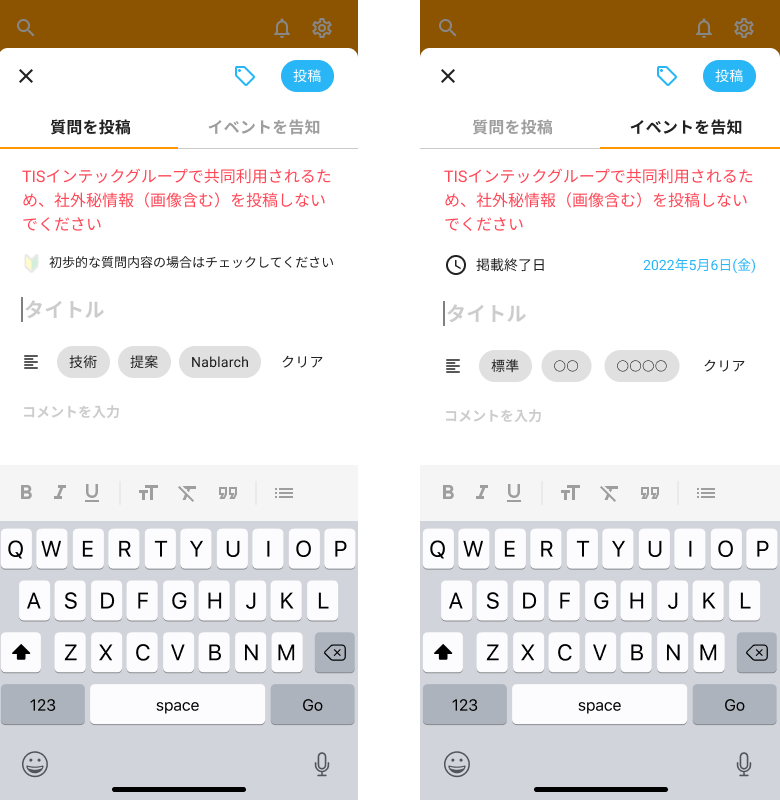

質問入力画面、イベント入力画面を作成します。

API呼び出しは後で実装するので、APIの戻り値は一旦、ソースコード上に直接記述して進めてください。

## 補足

| 補足箇所 | 説明 |
|--|--|
| 入力画面 | 入力画面はモーダルで開き、モーダル内で質問入力とイベント入力をタブで切り替えられるようにする。 下スワイプまたは入力画面左上の「×」ボタン押下で入力画面を閉じ、前画面を表示する。 |
| タグボタン | 押下で画面下部にタグの一覧をスライドアップ表示する。初期は未選択の状態。 タグは複数選択可とし、選択しているタグについては色を変える。
| 初心者マークボタン | 押下の度にON／OFFとし、初心者マークの透明度を変える。初期はOFFとする。 |
| キーボード | マークダウン入力は応用編で実装するため、現時点では非対応でよい。 |
| テンプレート入力ボタン | 各テンプレートボタン（「技術」、「提案」など）押下で選択されたテンプレート内容を入力欄に入力された状態とする。 テンプレートの内容はテンプレート一覧取得APIで取得した内容を表示する。 クリア押下で入力欄に入力された内容を削除する。 |
| 入力精査 | 質問タイトル、質問内容、イベントタイトル、イベント内容の必須チェックと、イベント掲載期間の日付チェック（当日以降）を行う。 チェックでエラーの場合は入力項目下部に赤字で是正を促すメッセージを表示する。 |
| 質問・イベントのタブ切り替え | タブ切り替え時は入力内容をクリアする。 入力フォームに文字が入力された状態で質問・イベントタブの切り替え操作をした場合に、入力内容がクリアされるが問題ないかを問う警告ダイアログを表示する。 警告ダイアログの選択肢は「はい」、「いいえ」とし、いいえが選択された場合は入力内容のクリアとタブの切り替えは行わない。 |
