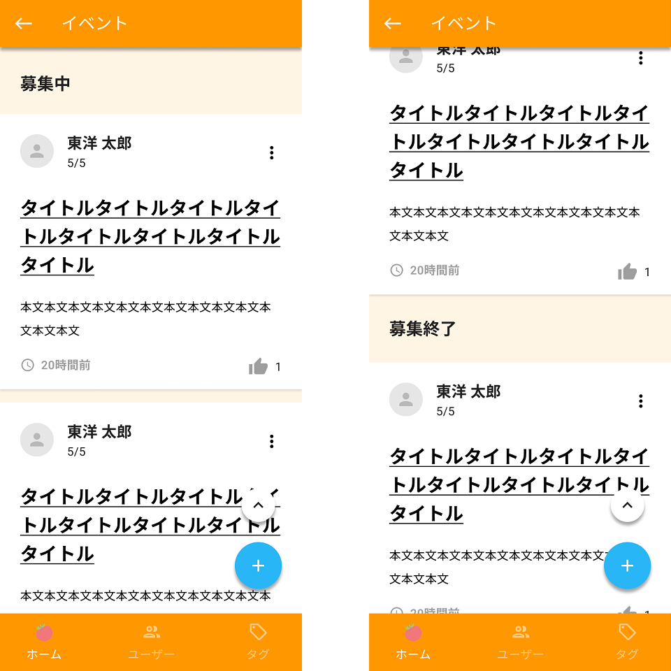

イベント一覧画面を作成します。

API呼び出しは後で実装するので、APIの戻り値は一旦、ソースコード上に直接記述して進めてください。

## 補足

| 補足箇所 | 説明 |
|--|--|
| ヘッダー | 戻るボタンと画面タイトルを表示する。戻るボタン押下で前画面へ遷移する。 |
| イベント一覧 | すべてのイベントを表示する。 |
| Pull-to-refresh | ページ最上部で下にスワイプして離すとPull-to-refreshとなるようにする。 refresh中はローディング中であることがわかるように、アクティビティインジケータを表示する。 |
| イベントタイトル | 押下でイベント詳細画面に遷移する。 |
| 縦の三点リーダー | 押下時の処理は実装対象外。 |
| 新規作成ボタン | ボタンは一覧画面の上に常に表示し、一覧画面をスクロールしても表示位置は固定とする。 押下でイベント入力画面に遷移する。 |
