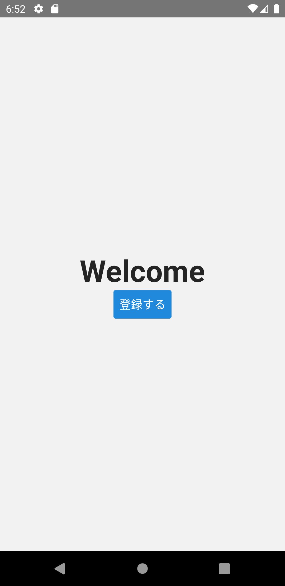

import Tabs from '@theme/Tabs';
import TabItem from '@theme/TabItem';

## ToDoアプリへようこそ

ではさっそくToDoアプリの実装をすすめていきましょう。
[ToDoアプリの仕様](../app-spec.md)に従い、ハンズオン形式でToDoアプリを実装していきます。
プロジェクトは[プロジェクトの作成](../../getting-started/create-project.md)で作成したものを使用します。

`App.tsx` ファイルを編集している場合は、[プロジェクト作成時のApp.tsx](https://github.com/ws-4020/rn-spoiler/blob/{@inject:rnSpoilerTag}/template/src/App.tsx)の内容に上書きしてからToDoアプリの実装をはじめてください。

`src/screens/home/Home.tsx`を`src/screens/home/Welcome.tsx`にリネームし、次のコードに置き換えてください。

```typescript jsx title="src/screens/home/Welcome.tsx"
import {useNavigation} from '@react-navigation/native';
import React from 'react';
import {StyleSheet, View} from 'react-native';
import {Button, Text} from 'react-native-elements';

export const Welcome: React.FC = () => {
  const navigation = useNavigation();
  return (
    <View style={styles.container}>
      <Text h1>Welcome</Text>
      <View>
        <Button onPress={() => navigation.navigate('Instructions')} title="登録する" />
      </View>
    </View>
  );
};

const styles = StyleSheet.create({
  container: {
    flex: 1,
    alignItems: 'center',
    justifyContent: 'center',
  },
});
```

`src/screens/home/index.ts`を次の通り修正してください。

:::note
次のマークで追加・削除箇所を示します。
変更は追加と削除の組み合わせで示します。

- `+`: 追加
- `-`: 削除
:::

```diff title="src/screens/home/index.ts"
- export * from './Home';
+ export * from './Welcome';
```

最後に`src/navigation/RootStackNav.tsx`を修正してください。

```diff title="src/navigation/RootStackNav.tsx"
  import {createStackNavigator} from '@react-navigation/stack';
  import React from 'react';
- import {Home, Instructions} from 'screens';
+ import {Welcome, Instructions} from 'screens';

  const nav = createStackNavigator();
  export const RootStackNav: React.FC = () => {
    return (
-     <nav.Navigator initialRouteName={Home.name}>
-       <nav.Screen name="Home" component={Home} options={{headerShown: false}} />
+     <nav.Navigator initialRouteName={Welcome.name}>
+       <nav.Screen name="Welcome" component={Welcome} options={{headerShown: false}} />
        <nav.Screen name="Instructions" component={Instructions} />
      </nav.Navigator>
    );
  };
```

[アプリの実装前に](../../basic-concepts/react-navigation-basics.mdx#3-レンダリングを定義)で述べたとおり、`initialRouteName`属性に画面名（`nav.Screen`の`name`属性の値）を指定すると、対応する画面が初期表示の画面になります。

修正できたら実行してください。
次の画面が表示できたら成功です。
次へ進みましょう。


