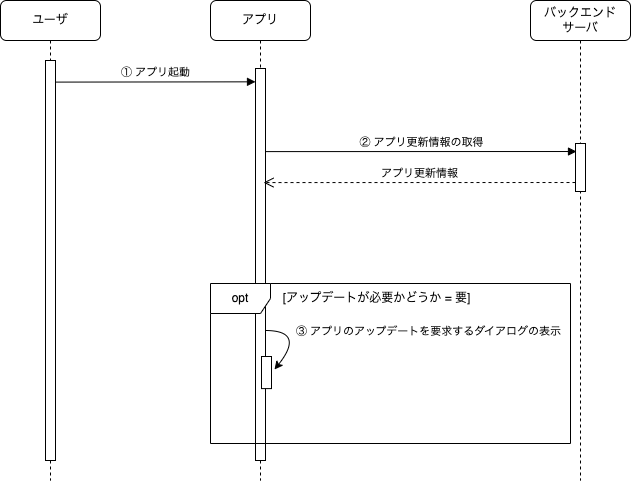

アプリをApp StoreやGoogle Playを介して配信する場合、アプリのアップデートタイミングはユーザに委ねられており、基本的には提供元ではコントロールできません。
しかし、重大なゼロデイ脆弱性を検知した場合や外部サービスのインターフェースが変更された場合など、ユーザの利用しているアプリを強制的にアップデートさせたいという要求は少なからずあります。

そのため、アップデートするまでユーザがアプリを利用できないようにする仕組みを提供します。

## アップデートを強制する要件

以下の対応を実施した場合は、アプリの強制アップデート対象とします。

- ゼロデイ脆弱性など、セキュリティ上の重大な問題を検知・修正した場合
- 外部サービスのインターフェースが変更された場合
- アプリの機能を追加、または更新した場合

ただし、アプリの機能を追加・更新した場合は、対応内容に応じて都度強制アップデート対象かを判断します。

## 強制アプリアップデートの処理フロー

アプリを強制的にアップデートする処理フローは以下になります。

| No | 処理           | 内容                                                                                                                                                                                                                                                                                                                                                                                  |
|:---|:-------------|:------------------------------------------------------------------------------------------------------------------------------------------------------------------------------------------------------------------------------------------------------------------------------------------------------------------------------------------------------------------------------------|
| ①  | アプリ起動        | ユーザがアプリを起動します。                                                                                                                                                                                                                                                                                                                                                                      |
| ②  | アプリ更新情報の取得   | アプリは、アプリ更新情報の取得APIを呼び出します。リクエストとして以下の情報を送信します。 ・端末のOS（iOS/Android） ・使用しているアプリのバージョン  アプリ更新情報の取得APIのレスポンスとしてアップデート要否を受け取ります。  なお、API呼び出し時にエラーが発生した場合は、[HTTP API通信で発生するエラーのハンドリング](../http-api/http-api-error-handling.mdx)を実施し、以降の処理には進みません。 （強制アプリアップデートは、[アプリ起動後の初期化処理](../life-cycle-management/initialization.mdx)で実施するため、スプラッシュスクリーンが表示された状態になります。） |
| ③  | アプリのアップデート要求 | ②で受け取ったアップデート要否が「要」の場合は、アップデートを要求するダイアログを表示して、App StoreやGoogle Playに誘導します。 また、アプリがアップデートされるまでは、ユーザがアプリの機能を利用できないようにします。                                                                                                                                                                                                                                                         |

## 関連する決定事項

- [強制アプリアップデート](../../decisions/adr-016-forced-app-updates.mdx)
