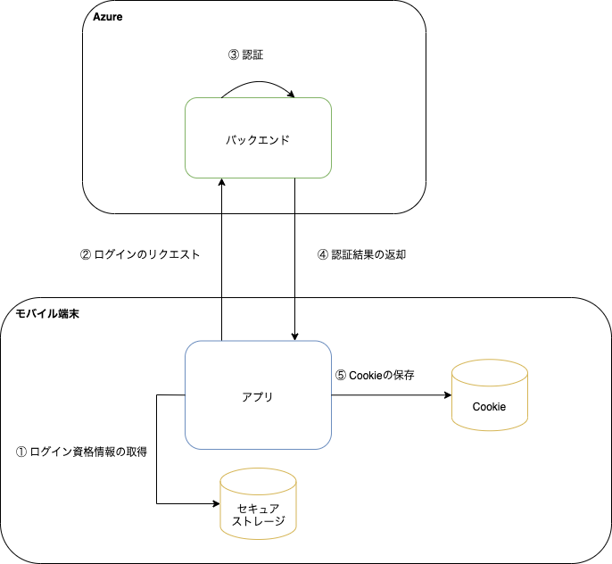

前回ログインしていたアカウントのログイン資格情報を用いて自動でログインします。ユーザはログイン操作なしにアプリの利用を開始できます。

このアプリでは、以下の場合に自動ログインをします。

- 匿名サインアップに成功した場合
- アプリにログイン後、ログアウトせずにアプリを終了してアプリを再起動した場合
- アプリ使用中にセッションIDの有効期限が切れた場合

<!-- markdownlint-disable MD024 -->

### 処理フロー

<!-- markdownlint-enable MD024 -->



| No | 処理 | 内容 |
|:--|:--|:--|
| ① | ログイン資格情報の取得 | アプリは、セキュアストレージから前回ログインしていたアカウントIDと、そのアカウントIDに紐づくパスワードを取得します。<br/>ただし、匿名サインアップ後は前回ログインしていたアカウントIDではなく、[バックエンドから返却されたアカウントID](signup.mdx#処理フロー)を使用します。 |
| ② | ログインのリクエスト | アプリは、アカウントIDとパスワードを用いてバックエンドにログインリクエストを送ります。 |
| ③ | 認証 | バックエンドは、ログインリクエストで受け取ったアカウントIDとパスワードを用いて認証処理をします。 |
| ④ | 認証結果の返却 | バックエンドは認証処理の結果をアプリに返却します。|
| ⑤ | Cookieの保存 | アプリは、バックエンドから認証処理の結果を受け取って、Cookie（セッションID）を保存します。Cookieの保存に関しては、[認証状態の維持](login.mdx#認証状態の維持)を参照してください。 |

<!-- markdownlint-disable MD024 -->

### 利用方法

<!-- markdownlint-enable MD024 -->

自動ログインは`AuthenticationService`の`autoLogin`メソッドを使用します。このメソッドを使用する前に、バックエンドからCSRFトークンを取得する必要があります。自動ログインに成功した後、バックエンドにアクセスするためには、CSRFトークンを再度取得する必要があります。

また、自動ログインする前に、自動ログインが可能かを検証します。前回ログインしていたアカウントIDと、そのアカウントIDに紐づくパスワードをセキュアストレージから取得できるかで、自動ログインが可能かどうかを検証しています。

```typescript title="自動ログインの利用方法"
import {AuthenticationService, csrfToken} from 'framework';

const autoLogin = useCallback(async () => {
  try {
    const canAutoLogin = await AuthenticationService.canAutoLogin();
    // 自動ログインが可能の場合は、自動ログインする
    if (canAutoLogin) {
      // CSRFトークンの取得
      await csrfToken();
      await AuthenticationService.autoLogin();
      // CSRFトークンの取得
      await csrfToken();
      return;
    }

    // 自動ログインできない場合は、ログイン画面に遷移するなどの処理を実装してください

  } catch (e) {
    // エラー処理
  }
}, []);
```

## 認証状態の維持

バックエンドへのHTTPリクエスト送信時に、Cookie経由でセッションIDを渡すことにより認証状態を維持します。

認証後に受け取ったCookie（セッションID）など、HTTPレスポンスとして受け取ったCookieは、ネイティブの機能で端末内に自動で保持されます。バックエンドへのHTTPリクエスト送信時には、ネイティブの機能でCookie（セッションID）を透過的に設定します。

なお、セッションIDには有効期限があります。有効期限切れを検知した場合は、自動ログインを使用してアプリが自動的に再度セッションIDを取得します。
