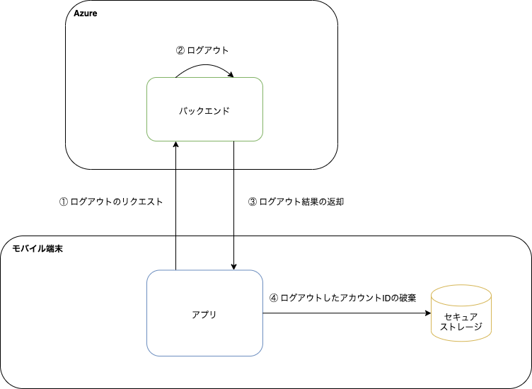

このアプリでは、Cookie経由で受け渡すセッションIDの破棄と、セキュアストレージからログイン中のアカウントIDを破棄することでログアウトします。

なお、ログアウト後もセキュアストレージにパスワードは保持します。 ユーザはログイン画面からアカウントIDを指定することにより、同じアカウントで再度ログインできます。

## 処理フロー

ログアウトの処理フローは以下になります。



| No | 処理 | 内容 |
|:--|:--|:--|
| ① | ログアウトのリクエスト | アプリは、バックエンドにログアウトリクエストを送ります。ネイティブの機能を利用して、端末内に保持されたCookie（セッションID）をHTTPリクエストに設定します。 |
| ② | ログアウト | バックエンドは、ログアウト処理（セッションの破棄）をします。 |
| ③ | ログアウト結果の返却 | バックエンドはログアウト処理の結果をアプリに返却します。 |
| ④ | ログアウトしたアカウントIDの破棄 | アプリは、ログイン中のアカウントIDとして保存していたアカウントIDを、セキュアストレージから破棄します。 |

## 利用方法

ログアウトは`AuthenticationService`の`logout`メソッドを使用します。

```typescript title="ログアウトの利用方法"
import {AuthenticationService} from 'framework';

const logout = useCallback(async () => {
  try {
    await AuthenticationService.logout();
  } catch (e) {
    // エラー処理
  }
}, []);
```
