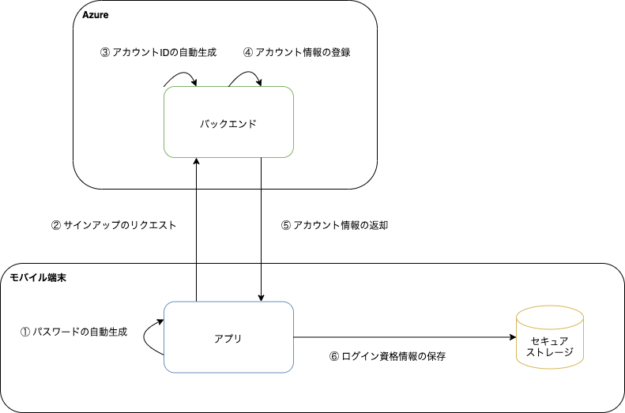

このアプリでは、自動サインアップ機能を提供します。ユーザはサインアップ操作なしにアプリを利用できます。

自動サインアップ機能を実現するために、ログイン資格情報をアプリとバックエンドで自動生成してアカウントを作成します。なお、このアプリにおけるログイン資格情報は以下を表します。

- アカウントID
- パスワード

作成したログイン資格情報は、セキュアストレージに保存します。

## 処理フロー

サインアップの処理フローは以下になります。



| No | 処理 | 内容 |
|:--|:--|:--|
| ① | パスワードの自動生成 | アプリは、パスワードを自動生成します。パスワードは16桁のランダムな文字列で構成されます。 |
| ② | サインアップのリクエスト | アプリは、ニックネームと生成したパスワードを用いてバックエンドにサインアップリクエストを送ります。 |
| ③ | アカウントIDの自動生成 | バックエンドは、サインアップリクエストを受け取ると、アカウントIDを自動生成します。アカウントIDはUUID（v4）で生成します。 |
| ④ | アカウント情報の登録 | バックエンドは、生成したアカウントIDとアプリから受け取ったパスワードなどを用いてアカウント情報をデータストアに保存します。 |
| ⑤ | アカウント情報の返却 | バックエンドはアプリにアカウント情報を返却します。|
| ⑥ | ログイン資格情報の保存 | アプリは、受け取ったアカウント情報からアカウントIDを取得し、パスワードと共にアカウントIDに紐づくパスワードとしてセキュアストレージに保存します。 |

## 利用方法

サインアップは`AuthenticationService`の`signup`メソッドを使用します。このメソッドを使用する前に、バックエンドからCSRFトークンを取得する必要があります。

```typescript title="サインアップの利用方法"
import {AuthenticationService, csrfToken, generatePassword} from 'framework';

const signup = useCallback(async () => {
  try {
    // CSRFトークンの取得
    await csrfToken();
    // パスワードの自動生成
    const password = await generatePassword();
    // サインアップ
    const res = await AuthenticationService.signup('[nickName]', password);
  } catch (e) {
    // エラー処理
  }
}, []);
```
