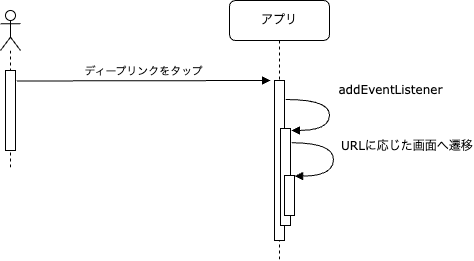

ディープリンクをアプリケーションで処理する方法について記載します。

## ディープリンクタップ時の処理フロー

ユーザがディープリンクをタップすると、アプリがフォアグランドで表示されます。
その際のアプリスタートの種類によりディープリンクの取り扱いが変わります。
アプリスタートの種類には次のものがあります。

- コールドスタート
- ウォームスタート
- ホットスタート

アプリスタートの種類の詳細は[アプリスタートの種類に応じた初期化処理](../life-cycle-management/overview.mdx#アプリスタートの種類に応じた初期化処理)を参照してください。

処理フローは以下になります。

### ホットスタートの場合

ホットスタートの場合、Expo Linkingの[addEventListener](https://docs.expo.dev/versions/latest/sdk/linking/#linkingaddeventlistenertype-handler)に設定した処理が呼ばれます。
この中でURLに応じた処理（画面遷移など）を行います。

### コールドスタートの場合

コールドスタートの場合、Expo Linkingの[getInitialURL](https://docs.expo.dev/versions/latest/sdk/linking/#linkinggetinitialurl)で取得したURLに応じた処理（画面遷移など）を行います。

### ウォームスタートの場合

#### iOS

コールドスタートの場合と同様の処理フローになります。Expo Linkingの[getInitialURL](https://docs.expo.dev/versions/latest/sdk/linking/#linkinggetinitialurl)で取得したURLに応じた処理（画面遷移など）を行います。

#### Android

Androidのウォームスタートの場合、前回起動時にExpo Linkingの[addEventListener](https://docs.expo.dev/versions/latest/sdk/linking/#linkingaddeventlistenertype-handler)に設定した処理が呼ばれます。
この中でURLに応じた処理（画面遷移など）を行います。

:::note
Androidは、[android:launchMode](https://developer.android.com/guide/topics/manifest/activity-element?hl=ja#lmode)によってActivityの起動方法が変わります。

`android:launchMode`の`singleTask`は、ウォームスタート時にActivityのインスタンスが作成されません。この場合、ディープリンクのURLはExpo Linkingの`addEventListener`で取得できます。

一方、`android:launchMode`の`standard`などは、ウォームスタート時にActivityのインスタンスが作成されます。この場合、ディープリンクのURLはExpo Linkingの`getInitialURL`で取得できます。

このアプリでは、Expoの[expo-template-bare-minimum](https://github.com/expo/expo/blob/main/templates/expo-template-bare-minimum/android/app/src/main/AndroidManifest.xml#L24)に合わせて、`android:launchMode`を`singleTask`に設定しています。
`android:launchMode`を`standard`変更することで、コールドスタートやiOSのウォームスタートと挙動を合わせることもできます。
しかし、Activityの起動変更がアプリに及ぼす影響を完全に把握できていません。

そのため、`android:launchMode`は`singleTask`にして、Expo Linkingの`addEventListener`で取得する方法としています。
:::

:::note
ウォームスタート時は、コンポーネントが再マウントされますが、モジュールの再読み込みはされません。`App.tsx`のtop levelなどで実行した処理は、ウォームスタート時に再実行されることはありません。

そのため、このアプリでは`addEventListener`の実行を、`App.tsx`のtop levelで実行しています。

詳細は、[App.tsx](https://github.com/{@inject:organization}/mobile-app-crib-notes/tree/master/example-app/SantokuApp/src/apps/app/App.tsx)を参照してください。
:::

## ディープリンクに応じた画面遷移

このアプリでは、ディープリンクに応じた画面を表示します。その画面から戻るボタンをタップした場合は、以下の仕様とします。

- 基本的には、ディープリンクをタップする前に表示していた画面に戻す
- 遷移先画面がボトムタブを表示しているナビゲーター（[Bottom Tabs Navigator](https://reactnavigation.org/docs/bottom-tab-navigator/)）の場合は、前の画面へ戻れないようにする

ディープリンクをタップする前に表示していた画面に戻すためには、画面遷移時の[Navigation action](https://reactnavigation.org/docs/navigation-actions)として`PUSH`を使用します。

`Bottom Tabs Navigator`に遷移する場合は、`NAVIGATE`を使用します。このアプリでは、`Bottom Tabs Navigator`をログイン（自動ログイン含む）後の初期画面としてNavigation Stackの最初に必ず設定しています。そのため、`NAVIGATE`で画面遷移することによりNavigation Stackの最初まで戻り、前の画面に戻れなくなります。

:::note
画面遷移に関しては、以下のDecision Recordに詳細な検証結果を記載しているので、こちらも参照してください。

- [ディープリンク受信時の画面遷移](../../decisions/adr-019-deep-link-navigation.mdx)
:::

### 認証状態の考慮

未認証時にディープリンクを受け取った場合は、ディープリンクを無視して通常通り起動するようにします。

その後、ユーザが認証した場合は、未認証時に受け取ったディープリンクの遷移先画面を表示します。

## ディープリンクのバリデーション

ディープリンクによっては、パスパラメータやクエリパラメータを取得して、画面表示時などに使用する場合があります。

これらのパラメータは、攻撃者によってアプリが意図しない値を設定される場合があります。そのため、取得したパラメータは必ずバリデーションを実施します。

バリデーションエラーとなった場合は、ディープリンクを無視して通常通り起動するようにします。
