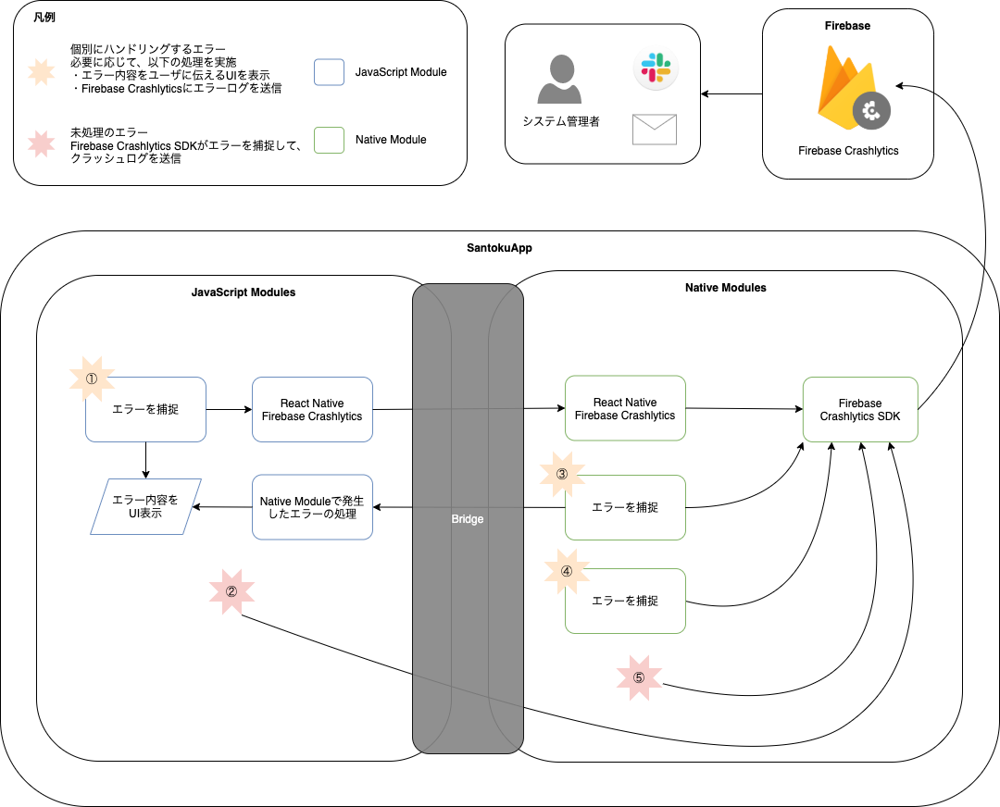

モバイルアプリでは、エラーが発生した場合にエラーの内容と、どのような手順で操作をすればエラーから回復できるかをユーザに伝える事が大切です。何も伝えずにアプリがクラッシュしてしまうと、ユーザのアプリ離脱率が高くなる一因になります。また、アプリがクラッシュしてしまった場合は、どのような操作でアプリがクラッシュしたかを特定することも重要です。

React Nativeを使用したモバイルアプリでは、発生したエラーをハンドリングしないとアプリがクラッシュします。
そのため基本方針として、エラーの発生する可能性がある箇所については個別にエラーを捕捉してエラーの内容と復旧手順を適切にユーザに伝えます。また、必要に応じてFirebase Crashlyticsにエラーログを送信します。

ただし、エラーのハンドリング漏れが発生する可能性はないとは断言できないため、未処理のエラーを捕捉してFirebase Crashlyticsにクラッシュログを送信します。

## エラーハンドリングの全体像

SantokuAppでエラーを捕捉してFirebase Crashlyticsにログを送信する全体像は以下になります。

| エラー処理パターン | 処理概要 |
|:--|:--|
|エラー処理パターン①|JavaScript Moduleでエラーを捕捉した場合は、エラー内容をUI表示します。また、必要に応じてReact Native Firebase Crashlyticsを経由してFirebase Crashlyticsにエラーログを送信します。|
|エラー処理パターン②|JavaScript Moduleで未処理のエラーは、React NativeのBridgeを経由して最終的にはFirebase Crashlytics SDKによって捕捉されます。Firebase Crashlytics SDKはクラッシュログをFirebase Crashlyticsに送信します。|
|エラー処理パターン③|Native Moduleでエラーを捕捉しエラー内容をUI表示するには、React NativeのBridgeを経由してエラーをJavaScript Moduleに連携します。エラーを受け取ったJavaScript Moduleはエラー内容をUI表示します。必要に応じて、直接Firebase Crashlytics SDKを使用してFirebase Crashlyticsにエラーログを送信します。|
|エラー処理パターン④|Native Moduleでエラーを捕捉後、Firebase Crashlytics SDKを使用してFirebase Crashlyticsにエラーログを送信します。エラー内容をUI表示しない場合は、直接Firebase Crashlytics SDKを使用します。|
|エラー処理パターン⑤|Native Moduleで未処理のエラーは、Firebase Crashlytics SDKに捕捉されます。Firebase Crashlytics SDKはクラッシュログをFirebase Crashlyticsに送信します。|

## 関連する決定事項

- [エラーハンドリング](../../decisions/adr-001-error-handling.mdx)
- [HTTP通信で使用するライブラリ](../../decisions/adr-002-http-api-libraries.mdx)
- [HTTP API通信で発生するエラーのハンドリング](../../decisions/adr-003-http-api-error-handling.mdx)
