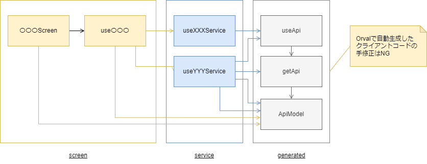

## クライアントコードの自動生成

このアプリでは、OpenAPI Specificationから自動生成したクライアントコード（以下、自動生成コード）を用います。
自動生成ツールには[Orval](https://orval.dev/)を使用します。
[Orval](https://orval.dev/)の使用方法は開発ガイドを参照してください。

## アプリケーション構造

HTTP API通信部分に焦点を当てたアプリケーション構造を以下に示します。



保守性や生産性、および役割の明確化を理由として、次のルールに従うこととします。

- 自動生成コードの手修正は禁止します。
- 自動生成コードは各サービスを介して画面から使用します。
  - カスタマイズする必要のない自動生成コードについては、各サービスがimportしてそのままexportします。
- 自動生成したデータモデルはどこからでも使用できます。
- 業務ルールの実装やデータ変換などは、サービスの役割とします。

## TanStack Queryのデフォルト設定

TanStack Queryには多数のオプションが用意されています。
これらのオプションは、全てのクエリやミューテーションに適用するデフォルト値を設定出来ます。
また、クエリ・ミューテーション毎にその値を上書きできます。

このアプリで設定するデフォルト値を以下に示します。
なお、ここで示していないオプション、および設定値が空白のものは、TanStack Queryが用意するデフォルト値に従います。

### クエリのデフォルトオプション

|オプション|デフォルト値|設定値| 説明                                                                                                                                                                                                                                                            |
|:--|:--|:--|:--------------------------------------------------------------------------------------------------------------------------------------------------------------------------------------------------------------------------------------------------------------|
|queryFn|||[Default Query Function](https://tanstack.com/query/v4/docs/react/guides/default-query-function)で紹介されているとおり、デフォルトのクエリ関数を定義出来ます。                                                                                                                               |
|retry|3|`false`|クエリ失敗時のリトライ回数です。[Important Defaults](https://tanstack.com/query/v4/docs/react/guides/important-defaults)で示されるとおり、デフォルト値は3です。このアプリでは、[HTTP API 通信のリトライ](./http-api-error-handling.mdx#http-api通信のリトライ)に従いリトライはユーザ自身の判断とします。`false`をデフォルト値として設定します（リトライしません）。   |
|retryOnMount|`true`||マウント時にリトライするかどうかを示します。デフォルト値は`true`です。                                                                                                                                                                                                                        |
|retryDelay|Exponential Backoff||リトライ時の遅延間隔を示します。デフォルトでは、リトライの度に指数関数的に待ち時間が増えていきます（Exponential Backoff）。                                                                                                                                                                                       |
|staleTime|0||クエリが「新しい」ものから「古くなる」までの期間です。クエリが「新しい」限り、クエリは取得済みのデータを返すため、ネットワークリクエストは発生しません。クエリが「古い」場合、クエリは取得済みのデータを返し、特定の条件下にてバックグラウンドで再フェッチします。[Important Defaults](https://tanstack.com/query/v4/docs/react/guides/important-defaults)で示されるとおり、デフォルト値は0です（フェッチ後すぐ古くなる）。    |
|cacheTime|5 &ast; 60 &ast; 1000||未使用なクエリを削除するまでの期間です。クエリを使用するすべてのコンポーネントがアンマウントされると、そのクエリは未使用となります。[Important Defaults](https://tanstack.com/query/v4/docs/react/guides/important-defaults)で示されるとおり、デフォルト値は5分です。                                                                               |
|refetchOnMount|`true`||マウント時に再フェッチするかどうかを示します。デフォルト（`true`）では、データが古くなっている場合に再フェッチします。                                                                                                                                                                                                |
|refetchOnWindowFocus|`true`||ウィンドウフォーカス時に再フェッチするかどうかを示します。デフォルト（`true`）では、データが古くなっている場合に再フェッチします。                                                                                                                                                                                          |
|refetchOnReconnect|`true`||再接続時に再フェッチするかどうかを示します。デフォルト（`true`）では、データが古くなっている場合に再フェッチします。                                                                                                                                                                                                 |
|structuralSharing|`true`||デフォルト（`true`）では、クエリ結果のデータの中身が変更されていない場合、データの参照が変更されません。これによりアプリのパフォーマンス向上が望めます。                                                                                                                                                                               |
|networkMode|`online`|`offlineFirst`|デフォルト（`online`）では、オフラインの場合にクエリが実行されません。このアプリでは、`offlineFirst`を設定してネットワークの状態に関わらず一度はクエリを実行するようにしています（TanStack Queryのv3と同じ動作です）。<br/><br/>オフライン時は、[HTTP APIからレスポンスが返却されない場合のエラーハンドリング](./http-api-error-handling#http-apiからレスポンスが返却されない場合のエラーハンドリング)に従ってハンドリングされます。|
|notifyOnChangeProps|||デフォルトでは、レンダリング中に使用している項目のみがtracking対象となります。コンポーネントは、tracking対象となった項目が変更された場合のみ再レンダリングされます。|

### ミューテーションのデフォルトオプション

|オプション|デフォルト値|設定値|説明|
|:--|:--|:--|:--|
|retry|0||ミューテーション失敗時のリトライ回数です。デフォルト値は0です。|
|retryDelay|Exponential Backoff||リトライ時の遅延間隔を示します。デフォルトでは、リトライの度に指数関数的に待ち時間が増えていきます（Exponential Backoff）。|
|cacheTime|5 &ast; 60 &ast; 1000||未使用なミューテーションを削除するまでの期間です。ミューテーションを使用するすべてのコンポーネントがアンマウントされると、そのミューテーションは未使用となります。デフォルト値は5分です。|
|networkMode|`online`|`offlineFirst`|デフォルト（`online`）では、オフラインの場合にミューテーションが実行されません。このアプリでは、`offlineFirst`を設定してネットワークの状態に関わらず一度はミューテーションを実行するようにしています（TanStack Queryのv3と同じ動作です）。<br/><br/>オフライン時は、[HTTP APIからレスポンスが返却されない場合のエラーハンドリング](./http-api-error-handling#http-apiからレスポンスが返却されない場合のエラーハンドリング)に従ってハンドリングされます。|

## クエリキーの管理

TanStack Queryはクエリキーに基づいてクエリをキャッシュ管理します。
自動生成コードについては、Orvalの生成ルール（URL内のPathとQuery部をクエリキーとして使用）に従います。
それ以外の独自クエリについては、`[サービス名, 関数名]`をクエリキーとして用います。

## データ更新時のキャッシュの扱いについて

`useQuery`を呼びだすと、取得済みのデータがあればそれを返し、必要に応じてクエリをバックグラウンドで再フェッチします。
そして再フェッチ完了後に新しいデータで画面を更新します。
再フェッチ中に取得済みデータを表示する動作は、頻繁なローディングインジケーターの表示を抑えUX向上に役立ちます。
一方で、更新後も一時的に古いデータが見えるため、ユーザの混乱を引き起こす可能性があります。

このアプリにおいては、こうした混乱を避けるため、ミューテーション成功時に再フェッチが必要なクエリのキャッシュデータを破棄します。

コード例は次の通りです。

```typescript jsx
const mutation = useMutation(addTodo, {
  onSuccess: () => {
    queryClient.resetQueries('todos');
  },
});
```

このコードでは、新しいタスクを追加した後にToDoリストのキャッシュデータを破棄します。
これにより再フェッチ中は画面にローディングインジケーターが表示されることになりますが、古いデータが表示されることはありません。

## 二重送信防止

ユーザの操作ミスによる二重送信を防止するため、HTTP API通信中に次の操作を制限します。

- 画面の初期ロードなど、ユーザ操作に直接起因しない通信については、一切の操作を制限しない
- 検索ボタン押下など、ユーザ操作に起因して発生した通信については、対象ボタンのみを押下不可とする
- ユーザ設定更新のような再設定可能な更新操作については、対象ボタンのみを押下不可とする
- 商品購入のような重要操作については、アプリ全体を操作不可とする

なお、ここでは言及していませんが、バックエンド側での対策は（必要に応じて）別途されているものとします。

## エラーハンドリング方式

エラーハンドリングについては、[HTTP API通信で発生するエラーのハンドリング](./http-api-error-handling.mdx)に従います。
共通的なエラーハンドリング処理は、個別で実装せず共通化します。
また、HTTPステータスコード401が返却された場合の通信リトライについても共通部品にて実現します。

### エラーハンドリングの共通化

`QueryClient`のデフォルトオプションを利用すると、各クエリのエラーハンドリングをデフォルト設定できます。
しかしながら、上記方法だと次の課題が発生します。

- `useQuery`の`onError`に独自のハンドラ関数を個別設定すると、`QueryClient`のデフォルトオプションに設定したものが上書きされる
- 同じクエリを使用した画面が複数存在すると、エラー処理も複数回実行される（例えば同じトーストが複数表示される）

そこで、共通のエラーハンドラ関数は`QueryCache`の`onError`に設定します。

ミューテーションについても同様の対策とします。
詳細は次のドキュメントを参照してください。

- [QueryCache - Global callbacks](https://tanstack.com/query/v4/docs/reference/QueryCache#global-callbacks)
- [MutationCache - Global callbacks](https://tanstack.com/query/v4/docs/reference/MutationCache#global-callbacks)

個別にエラー処理を実施するためグローバルエラーハンドリングが不要な場合は、以下のいずれかで無効化できます。

- `useQuery`のqueryOptionsとして```{meta: {disableGlobalErrorHandler: true}}```を指定する
- useQueryやuseMutationに渡す非同期関数内で、ApplicationErrorを継承したエラーをthrowする

### HTTPステータスコード401返却時の通信リトライ

HTTPステータスコード401が返却された場合、新しいセッションIDを再取得しリトライする機能が必要です。
このアプリでは、次のようにaxiosのInterceptorsの機能を利用してセッションの再接続を実現します。

```typescript
  const onRejected = async (error: unknown) => {
    if (axios.isAxiosError(error)) {
      if (error.response?.status === 401) {
        try {
          await refreshSession();
          return await BACKEND_AXIOS_INSTANCE_WITHOUT_REFRESH_SESSION.request(error.config);
        } catch (retryError) {
          throw error;
        }
      }
    }
    throw error;
  };
  setAxiosResponseInterceptor(onFulfilled, onRejected);
```

## ページネーションと無限スクロール方式

リモートにある膨大なデータから、アプリ内で必要なデータのみを取得して表示するには、ページネーションや無限スクロールへの対応が必要です。
TanStack Queryには、ページネーションや無限スクロールの仕組みが用意されています。

- [Paginated / Lagged Queries](https://tanstack.com/query/v4/docs/react/guides/paginated-queries)
- [Infinite Queries](https://tanstack.com/query/v4/docs/react/guides/infinite-queries)

上記仕組みを実現するため、バックエンドAPIの仕様を次のとおり統一します。

### ページネーション

| URLクエリパラメータ | 説明 |
| :-- | :-- |
| page | 開始ページ番号 |
| size | ページサイズ   |
| sort | ソート項目     |

総ページ数や全要素数は、HTTPボディの項目として返却します。

| HTTPボディの項目 | 説明 |
| :-- | :-- |
| content | レスポンスデータ |
| empty | ページが0件かどうか |
| first | 最初のページかどうか |
| last | 最後のページかどうか |
| number | 何ページ目か |
| size | ページサイズ |
| sort | ソート項目 |
| numberOfElements | ページに含まれる要素の件数 |
| pageable | リクエストで指定した`page`、`size`、`sort`を保持するオブジェクト |
| totalElements | 全要素数 |
| totalPages | 総ページ数 |

それぞれの項目は、ページネーションを実現するすべてのAPIに用意する必要はありません。
APIごとに必要な項目のみ取捨選択することとします。

### 無限スクロール

TanStack Queryの`useInfiniteQuery`フックは、読み込んだページのキャッシュデータを配列（`data.pages`）で保持します。
追加読込みをしたレスポンスデータは、その配列にページとして追加されます。
無限スクロールのよくある例として、アプリはそのキャッシュデータを1つの画面に全て表示します。
その為、ページネーションAPIの仕様を無限スクロールに利用した場合、次の恐れがあります。

- 読込み済みページの範囲でデータの追加が行われると、後続の追加読込みで重複されたデータが読み込まれる
- 読込み済みページの範囲でデータの削除が行われると、後続データのページ番号がずれ、表示されないデータが出る

そうした事象を避けるため、無限スクロールのAPI仕様はページネーションのそれとは別で定義します。

| URLクエリパラメータ | 説明 |
| :-- | :-- |
| cursor | カーソル |
| limit | 最大取得件数 |

データ位置を指し示すカーソルは、HTTPボディの項目として返却します。

| HTTPボディの項目 | 説明 |
| :-- | :-- |
| content | レスポンスデータ |
| hasPrevious | 前のデータがあるかどうか |
| previousCursor | 前のカーソル |
| hasNext | 次のデータがあるかどうか |
| nextCursor | 次のカーソル |

それぞれの項目は、無限スクロールを実現するすべてのAPIに用意する必要はありません。
APIごとに必要な項目のみ取捨選択することとします。

## クエリのキャンセル

[Query Cancellation](https://tanstack.com/query/v4/docs/react/guides/query-cancellation)に記載されている通り、TanStack Queryはクエリ関数に[AbortSignal](https://developer.mozilla.org/ja/docs/Web/API/AbortSignal)を渡してくれます。
そのAbortSignalを、axiosに渡すことでHTTP API通信のキャンセルが可能です。

Orvalで自動生成されたコードは、クエリ関数でAbortSignalを受け取りaxiosへ渡すようになっています。

Orvalで自動生成されたカスタムフックを使用しない場合は、AbortSignalを受け取るように自前で実装する必要があります。

```typescript
const query = useQuery(
  ['app-updates', 'requestAppUpdates'],
  ({signal}) => requestAppUpdates(params, signal),
);
```

上記のように実装したクエリのキーを、`queryClient.cancelQueries`に渡すことで、HTTP API通信をキャンセルできます。

```tsx
const queryClient = useQueryClient();

return (
  <Pressable onPress={() => queryClient.cancelQueries(['app-updates', 'requestAppUpdates'])}>
    <Text>Cancel</Text>
  </Pressable>
);
```
