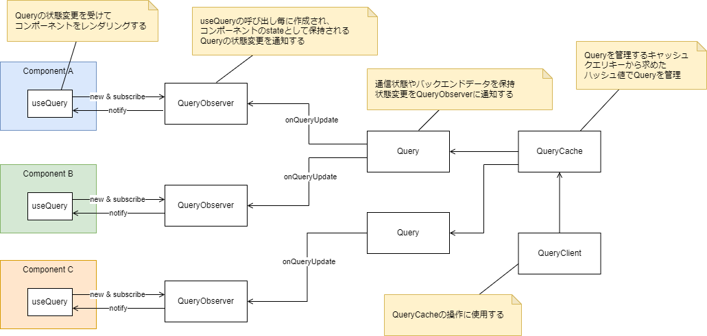

このアプリでは、HTTP通信に以下のライブラリを使用します。

- [axios](https://github.com/axios/axios)
- [React Query](https://react-query.tanstack.com/)

:::note
React Queryは現時点（2022年2月）で最新のv3系を使用します。
:::

## React Queryとは

React Queryとは、Reactフックを用いたデータフェッチ用ライブラリです。
React Queryを用いることで次のことが実現できます。

- サーバ状態の管理（フェッチ、キャッシュ、同期、更新）
- 宣言的なエラーハンドリング

axiosとReact Queryを用いてHTTP API通信する例は、以下のコードです。

```typescript jsx
const queryCache = new QueryCache();
const queryClient = new QueryClient({ queryCache });

export default function App() {
  return (
    <QueryClientProvider client={queryClient}>
      <View style={styles.container}>
        <Example />
      </View>
    </QueryClientProvider>
  );
}

type ResponseData = {
  name: string;
  description: string;
};

function Example() {
  const { isLoading, error, data } = useQuery<ResponseData, AxiosError>("repoData", () =>
    axios
      .get<ResponseData>("https://api.github.com/repos/Fintan-contents/mobile-app-crib-notes")
      .then((res) => res.data)
  );

  if (isLoading) return <Text>Loading...</Text>;
  if (error) return <Text>Error: {error.message}</Text>;

  return (
    <>
      <Text>{data?.name}</Text>
      <Text>{data?.description}</Text>
    </>
  );
}
```

このコードから分かるとおり、HTTP API通信をフックで宣言的に記述でき、通信状態に応じたシンプルなレンダリング定義が可能となります。

## React Queryの仕組み

React Queryを使用すると、エラーのハンドリングやローディング状態などの管理が楽になり、効率良く開発ができます。
その反面、React Queryを使いこなすには最低限の学習が必要です。React Queryの仕組みを理解せずに使用すると、開発で思わぬ落とし穴に遭遇する可能性があります。

そこで、ここでは簡単にReact Queryの仕組みについて紹介します。
以下の図は、React Queryの代表的な機能である`useQuery`フックがどのように動作するかを表したものです。



`useQuery`フックを呼びだすと、`QueryObserver`が作成されます。`QueryObserver`は、コンポーネントの`state`として管理されます。
`QueryObserver`は`QueryCache`から`Query`を取得します。`QueryCache`はクエリキーに対する`Query`がキャッシュにあればそれを返し、なければ生成します。
`QueryObserver`は`Query`の変更を観察し、変更があればそれをリスナー（`useQuery`内部の関数）に通知します。
リスナーは、`Query`の状態変更を受けてコンポーネントを再レンダリングします。

上記説明から分かる通り、React Queryはクエリキーで`Query`を一元的に管理します。
複数のコンポーネントから同じクエリキーを使用して`useQuery`フックを呼びだすと、1つの`Query`の状態をそれぞれのコンポーネントが共有することに注意してください。
