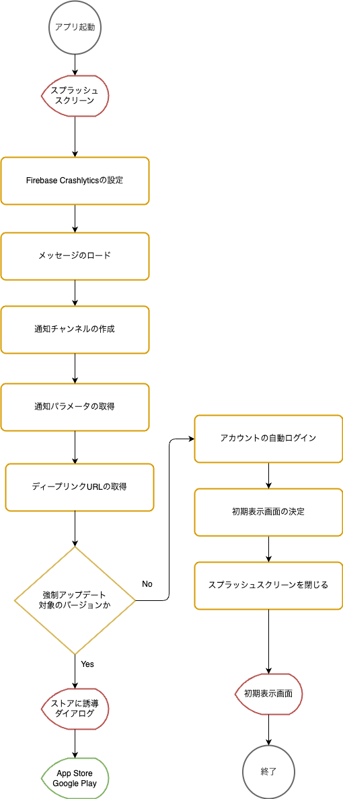

SantokuAppでは、アプリ起動後にスプラッシュスクリーンを表示してアプリの初期化処理を実施します。初期化処理は、アプリ起動後に確認しなければいけない事項のチェックや、アプリ全体で共有する情報を取得します。また、取得した情報などに応じてスプラッシュスクリーンを閉じた後に表示する画面を決定します。

## 初期化処理のフロー

アプリ起動後の初期化処理のフローは以下になります。

| 初期化処理        | 概要 |
| :------------- | :------------- |
| Firebase Crashlyticsの設定1 | Firebase Crashlyticsの初期設定（起動IDの設定など）を行います。 |
| メッセージのロード | アプリで使用するメッセージを読み込みます。以降の処理ではここで取得したメッセージを使用するため、アプリ起動後の早いタイミングでメッセージを読み込みます。 |
| 通知パラメータの取得 | 通知領域に表示されたメッセージをタップしてアプリを起動した場合は、Push通知に含まれるデータを取得します。 |
| ディープリンクパラメータの取得 | ディープリンクからアプリを起動した場合は、ディープリンクに含まれるURLパラメータを取得します。 |
| 強制アップデート対象のバージョン確認 | 起動したアプリのバージョンが強制アップデートの対象かを確認します。対象の場合は、App StoreかGoogle Playのどちらかに誘導します。 |
| キャッシュの削除 | HTTP通信で使用したデータや、カメラ、フォトライブラリから取得した画像ファイルは、アプリの内部ストレージにキャッシュされている場合があります。それらの内、機密情報を含むデータをキャッシュから削除します。 |
| [初期データの取得](#初期データの取得) | 初期処理で使用する情報や、アプリ全体で共有する情報を取得して、コンテクストに設定します。 |
| Firebase Crashlyticsの設定2 | Firebase Crashlyticsの設定を行います。認証後のアカウントIDを設定します。 |
| [初期表示画面の決定](#初期表示画面の決定) | 取得した初期データや、通知パラメータ、ディープリンクパラメータに応じて初期表示画面を決定します。 |

### 初期データの取得

初期表示画面を決定するために必要な情報や、アカウント情報などのアプリ全体で共有する情報を取得します。初期データの取得のフローは以下になります。

### 初期表示画面の決定

取得した初期データや、通知パラメータ、ディープリンクパラメータに応じて初期表示画面を決定します。初期表示画面の決定のフローは以下になります。

