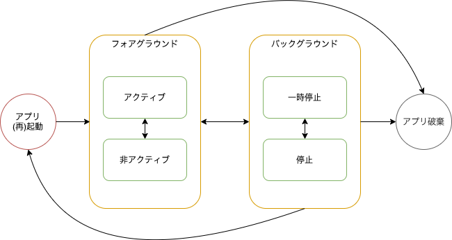

<!-- textlint-disable ja-technical-writing/sentence-length,ja-technical-writing/max-comma,ja-spacing/ja-no-space-around-parentheses,jtf-style/3.3.かっこ類と隣接する文字の間のスペースの有無,ja-technical-writing/ja-no-mixed-period,ja-technical-writing/no-unmatched-pair -->

import {PageList} from '../../../../../src/components';
const initialization = [
  {
    title: 'アプリ起動後の初期化処理',
    to: '/react-native/santoku/application-architecture/life-cycle-management/initialization',
  },
]

<!-- textlint-enable ja-technical-writing/sentence-length,ja-technical-writing/max-comma,ja-spacing/ja-no-space-around-parentheses,jtf-style/3.3.かっこ類と隣接する文字の間のスペースの有無,ja-technical-writing/ja-no-mixed-period,ja-technical-writing/no-unmatched-pair -->

## アプリの状態

モバイルアプリは、アプリの起動から停止までのライフサイクルの中で様々な状態に遷移します。

ユーザが他のアプリを起動した場合、フォアグラウンドにあったアプリはバックグラウンドに移動します。ユーザが多くのアプリを起動している場合、バックグラウンドに移動したアプリがOSの判断によって停止されることもあります。

こういった、アプリのライフサイクルについてはそれぞれのOSの公式ドキュメントで詳細に説明されています。

- [Android - アクティビティのライフサイクルについて](https://developer.android.com/guide/components/activities/activity-lifecycle?hl=ja)
- [iOS - Managing Your App's Life Cycle](https://developer.apple.com/documentation/uikit/app_and_environment/managing_your_app_s_life_cycle?language=objc)

以下は、このアプリで必要となる状態に焦点を当てて、アプリのライフサイクルを簡略化して示したものです。

React Nativeを使用したモバイルアプリでは、[AppState](https://reactnative.dev/docs/appstate#app-states)を利用してこれらの状態の変化を扱うことができます。それぞれの状態に遷移する代表的な操作とあわせて、以下に紹介します。

### フォアグラウンドでの状態

- アクティブ（`active`）
  - アプリを起動したとき
  - 他アプリやホーム画面からこのアプリに切り替えたとき
- 非アクティブ（`inactive`、iOSのみ）
  - [通知センター](https://support.apple.com/ja-jp/HT201925#control-center)、[コントロールセンター](https://support.apple.com/ja-jp/HT202769)を開いたとき
  - [Appスイッチャー](https://support.apple.com/en-us/HT202070)を表示したとき

### バックグラウンドでの状態

- 一時停止（`background`）
  - 他のアプリやホーム画面に切り替えたとき
  - 画面がロックされたとき
  - [通知ドロワー](https://developer.android.com/guide/topics/ui/notifiers/notifications?hl=ja#bar-and-drawer)を開いたとき（Android）
  - [最近の画面](https://developer.android.com/guide/components/activities/recents)を表示したとき（Android）
- 停止
  - メモリ解放などの目的で、OSによりアプリが停止されたとき

## アプリスタートの種類に応じた初期化処理

アプリをスタートする（アプリがフォアグラウンドにない状態からフォアグラウンドに表示する）とき、操作前のアプリの状態によって起動プロセスが大きく異なります。

そのため、アプリスタートの種類を操作前のアプリの状態に応じて次のように整理しておきます。

| スタートの種類    | 概要                                                            |
|:---------------|:----------------------------------------------------------------|
| コールドスタート | アプリが全く起動していない「アプリ破棄」状態からアプリを起動すること        |
| ウォームスタート | 「停止」状態のアプリをフォアグラウンドに表示すること                     |
| ホットスタート   | 「非アクティブ」状態や「一時停止」状態のアプリをフォアグラウンドに表示すること |

このアプリでは、アプリをフォアグラウンド化する操作として以下の方法を想定しますが、上記すべての種類に対応する必要があります。

- アプリアイコンをタップ
- ディープリンクをタップ
- 通知をタップ
- OS機能でのアプリ切替

### コールドスタート、ウォームスタート

React Nativeアプリでは、コールドスタートとウォームスタートはほぼ同等です。

JavaScriptで実装されるアプリの初期化処理は、以下の処理内でアプリの初期化処理を行うことに対応します。これらの処理はコールドスタートの場合だけでなく、ウォームスタートの場合にも呼ばれるので、JavaScriptのみで実装したアプリではこれらの区別はほぼ必要ありません。

- Android: アクティビティの`onCreate`
- iOS: AppDelegateの`didFinishLaunchingWithOptions`

このアプリでも、コールドスタートとウォームスタートの場合にアプリの初期化処理を実行します。

<PageList overviews={initialization} colSize={12} />

### ホットスタート

ディープリンクや通知をタップすることで、バックグラウンドで一時停止状態となっているアプリをフォアグラウンドに表示できます。

こういった起動方法の場合、タップしたディープリンクや通知のデータをアプリで受信して、データに応じた初期化処理を行いたいことがあります。
例えば、ディープリンクに応じて表示する画面を変更し、ディープリンクから取得したパラメータを初期値として入力欄に設定する画面などが考えられます。
詳細は以下の内容を参照してください。

- [ディープリンクの処理](../deep-link/process-deep-link.mdx)
- [通知センターのプッシュ通知タップ時の処理フロー](../push-notification/receive-push-notification.mdx#通知センターのプッシュ通知タップ時の処理フロー)

なお、アプリアイコンのタップやOS機能でのアプリ切替でもアプリがホットスタートすることはありますが、そのときは以前の作業状態に戻れば良いので特別な初期化処理は行いません。

## 補足

ドキュメントは見つけられませんでしたが、Androidの場合はアクティビティの`onResume`で`active`にし、`onPause`で`background`にしているようです。（[react-native/AppStateModule.java at v0.63.4 · facebook/react-native](https://github.com/facebook/react-native/blob/v0.63.4/ReactAndroid/src/main/java/com/facebook/react/modules/appstate/AppStateModule.java)）

一方、iOSでは以下のイベントに対応して状態を変えているようです。（[react-native/RCTAppState.mm at v0.63.4 · facebook/react-native](https://github.com/facebook/react-native/blob/v0.63.4/React/CoreModules/RCTAppState.mm)）

<!-- textlint-disable ja-technical-writing/sentence-length -->
- `UIApplicationDidBecomeActiveNotification`, `UIApplicationDidEnterBackgroundNotification`, `UIApplicationDidFinishLaunchingNotification`
  <!-- textlint-enable ja-technical-writing/sentence-length -->
  - [`UIApplication`の`applicationState`](https://developer.apple.com/documentation/uikit/uiapplication/1623003-applicationstate?language=objc)に応じて、`active`, `background`, `unknown`のいずれか
- UIApplicationWillResignActiveNotification
  - `inactive`
- UIApplicationWillEnterForegroundNotification
  - `background`
