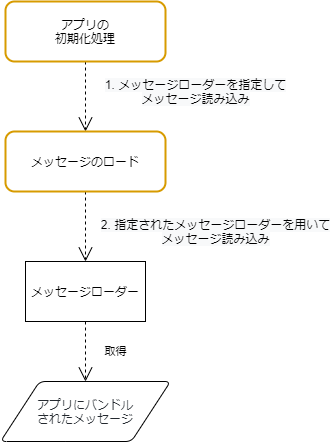

画面の表示項目やメッセージを管理しない場合、画面ごとにメッセージがハードコーディングされ、アプリ全体としての文言や文体の体裁が統一されず、UI/UXの品質低下を招きます。
また、メッセージの変更が発生した場合、変更箇所が多岐にわたります（低い保守性）。
その他にも、多言語対応する場合の拡張性も低いものとなります。

上にあげた理由により、メッセージを集約的に管理します。

## メッセージ管理方式

メッセージ管理方式の全体像は以下になります。

1. アプリの初期処理でメッセージローダーを指定してメッセージ読み込み処理を呼び出し
2. アプリ内にバンドルされたメッセージをメッセージローダーの実装クラスを通じて読み込み

## 関連する決定事項

- [メッセージ管理の方針](../../decisions/adr-005-message.mdx)
