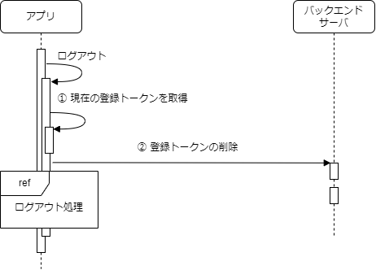

ログアウト時に登録トークンを削除します。

## 処理フロー

処理フローは以下になります。

| No | 処理 | 内容 |
|:--|:--|:--|
| ① | 現在の登録トークンを取得 | 現在の登録トークンを取得します。 |
| ② | 登録トークンの削除 | 登録トークンを削除します。登録トークン更新APIでは、更新前と更新後の登録トークンをリクエストで指定します。更新前に現在の登録トークンを指定し、更新後には何も指定せずAPIを呼びだすことで現在の登録トークンを削除します。 |

## エラー発生時の処理

登録トークンの削除に失敗した場合、バックエンドサーバに登録トークンが残るのでプッシュ通知が有効なままとなります。
これはセキュリティ上望ましくないため、登録トークンの削除に失敗した場合はログアウト処理全体を失敗させます。
