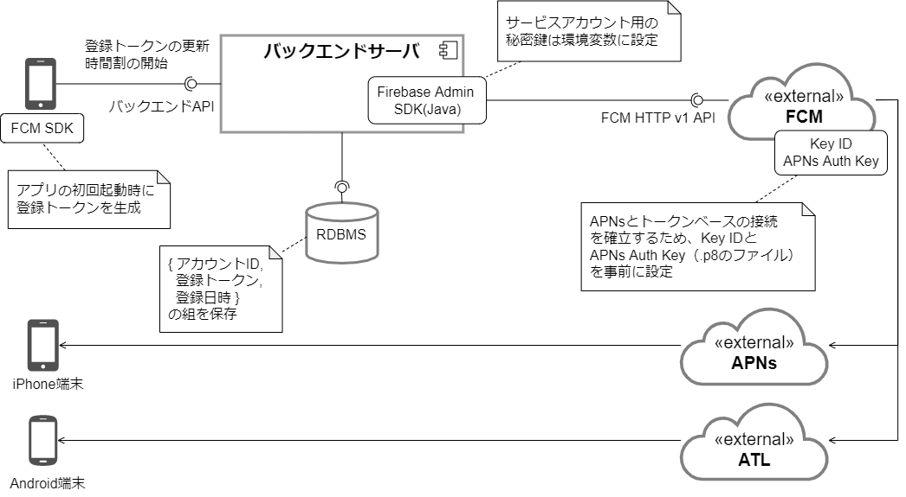

このアプリでは、以下の場面でプッシュ通知を利用します。
プッシュ通知にはリモート通知を用います。

- 時間割の開始をチームメンバーへ通知する

## プッシュ通知の方式

プッシュ通知はFirebase Cloud Messaging (FCM)を介して各OSのプッシュ通知送信用サービスを利用します。

プッシュ通知方式の全体像を以下に示します。

- アプリの初回起動時に登録トークンが生成されます。このトークンはプッシュ通知の宛先として使用します。
- 登録トークンはバックエンドサーバで一元管理し、バックエンドサーバが登録トークンを用いてFCMへプッシュ通知の送信リクエストを送ります。
- FCMは次のサービスを介して各端末へプッシュ通知を送信します。
  - Android: Android Transport Layer (ATL)
  - Apple Push Notification service (APNs)

### 登録トークンの管理

登録トークンはアプリのインスタンスを一意に識別する文字列です。
アプリの初回起動時にFCM SDKによって生成されます。
このトークンを用いてプッシュ通知を送信します。

[FCM登録トークン管理のベストプラクティス](https://firebase.google.com/docs/cloud-messaging/manage-tokens)に従い、バックエンドサーバのデータベースで登録トークンを管理します。
アカウントID、登録トークン、登録日時の組をデータベースで管理し、次のタイミングで更新します。

- アカウントのログインやログアウト
- プッシュ通知の送信エラー受信時

:::note
登録トークンは次のような場合に変更されることがあります。

- アプリが新しいデバイスで復元される場合
- ユーザがアプリをアンインストール / 再インストールする場合
- ユーザがアプリのデータを消去する場合
:::

### FCMを介したプッシュ通知の送信

バックエンドサーバからFCMへプッシュ通知の送信リクエストを送ります。
FCMとの連携に必要なサービスアカウント用の秘密鍵（JSON）は環境変数に保持します。

リモート通知はデバイス指定で送信します。
通知はアカウント単位とし、アカウントに紐づく全デバイスへ送信します。

送信効率のためマルチキャスト送信を用いて複数の宛先へ同時にメッセージを送信します。 宛先が500デバイスを超える場合は、複数回のリクエストに分けて送信します。FCMから無効なトークンのエラー応答（UNREGISTERD）が返ってきた場合、登録トークンをデータベースから削除します。

### FCMの設定

FCMがAPNsを介してプッシュ通知を送信するためには、Apple DeveloperアカウントのAPNs Auth KeyをFCMに設定する必要があります。
また、プッシュ通知が有効化されたプロビジョニングプロファイルを用いてアプリをビルドすることも必要です。
[iOS Messaging Setup](https://rnfirebase.io/messaging/usage/ios-setup)に従い、事前に設定してください。

:::note
APNsを利用するには、認証トークン（p8形式）またはサーバ証明書（p12形式）が必要です。
APNs Auth Keyは認証トークンのことであり、Firebaseではこちらの使用が推奨されています。
それぞれ特徴は次のとおりです。

- 認証トークン
  - アカウント単位で管理（アカウントが保有する全アプリで使用可能）
  - 本番環境と開発環境で同じトークンを使用
  - 有効期限は無期限
  - 1つのアカウントで2つまでしか発行できない
- サーバ証明書
  - アプリ単位で管理
  - 本番環境と開発環境で別々に証明書が必要
  - 有効期限は1年で毎年の更新が必要
:::

## 関連する決定事項

- [プッシュ通知方式の方針](../../decisions/adr-008-push-notification.mdx)
- [FCM を用いたプッシュ通知の管理方針](../../decisions/adr-009-push-notification-fcm.mdx)
- [プッシュ通知の内容に関する方針](../../decisions/adr-010-push-notification-contents.mdx)
