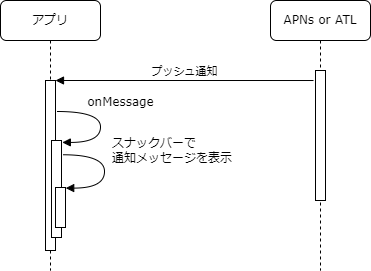
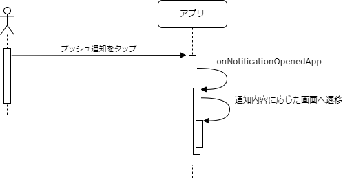
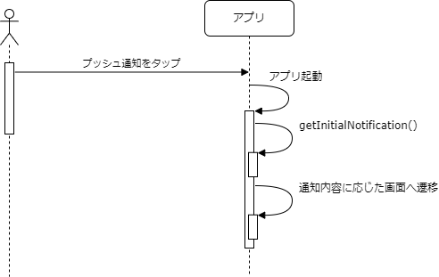

iOSやiPadOSアプリの場合はAPNsから、Androidアプリの場合はATLからそれぞれプッシュ通知を受信します。

## プッシュ通知受信時の処理フロー

アプリの状態がフォアグラウンドの場合とそれ以外の場合で処理フローが異なります。

プッシュ通知を受信した際、アプリの状態により通知の取り扱いが変わります。
アプリの状態には次のものがあります。

- フォアグラウンド（アクティブ）
- フォアグラウンド（非アクティブ）
- バックグラウンド（一時停止）
- バックグラウンド（停止）

アプリの状態の詳細は[アプリの状態](../life-cycle-management/overview.mdx#アプリの状態)を参照してください。

処理フローは以下になります。

### フォアグラウンドの場合

アプリの状態がフォアグラウンドの際にプッシュ通知を受信すると、`onMessage`に設定した処理が呼ばれます。
`onMessage`で受け取った通知内容をスナックバーでアプリ上に表示します。その他、通知内容に応じた処理があれば行いますが、画面遷移などユーザの操作を妨げる処理は行わないこととします。

:::note
iOSやiPadOSの場合、フォアグラウンド（非アクティブ）の場合でも`onMessage`に設定した処理が呼ばれます。
つまり、[通知センター](https://support.apple.com/ja-jp/HT201925#control-center)、[コントロールセンター](https://support.apple.com/ja-jp/HT202769)を開いているときや、[Appスイッチャー](https://support.apple.com/en-us/HT202070)を表示している時にも通知内容はスナックバーでアプリ上に表示されます。
画面が隠れている状態で通知内容が表示されるため、ユーザが通知に気づかない恐れがあります。そのため、ユーザの確認が必要な内容は通知以外でお知らせする必要があります。

Androidの場合、[通知ドロワー](https://developer.android.com/guide/topics/ui/notifiers/notifications?hl=ja#bar-and-drawer)を開いたときでも（アプリの状態に反して）`onMessage`に設定した処理が呼ばれます。一方で、アプリ切り替え中はバックグラウンドの状態となります。iOSやiPadOSと動きが異なるため注意してください。
:::

### フォアグラウンド以外の場合

フォアグラウンド以外の状態でプッシュ通知を受信すると、通知は通知センターに表示されます。
アプリはプッシュ通知を受信した時点では何も行いません。

:::note
フォアグラウンド以外の状態でプッシュ通知を受信すると、`BackgroundMessageHandler`に設定した処理が動作します。
iOSやiPadOSの場合、APNsペイロード内の`content-available`が`true`に設定されている場合のみ、この処理が呼ばれることに注意してください。
詳細は、[アプリがアクティブでない時にメッセージを受信した場合の処理](../../../../reference/notification/client.md#アプリがアクティブでない時にメッセージを受信した場合の処理)を参照してください。
:::

## 通知センターのプッシュ通知タップ時の処理フロー

通知センターのプッシュ通知をタップ時するとアプリがフォアグランドで表示します。
その際のアプリスタートの種類により通知の取り扱いが変わります。
アプリスタートの種類には次のものがあります。

- コールドスタート
- ウォームスタート
- ホットスタート

アプリスタートの種類の詳細は[アプリスタートの種類に応じた初期化処理](../life-cycle-management/overview.mdx#アプリスタートの種類に応じた初期化処理)を参照してください。

処理フローは以下になります。

### ホットスタートの場合

ホットスタートの場合、`onNotificationOpenedApp`に設定した処理が呼ばれます。
この中で通知内容に応じた処理（画面遷移など）を行います。

### コールドスタートまたはウォームスタートの場合

React Nativeアプリでは、コールドスタートとウォームスタートはほぼ同等です。
コールドスタートまたはウォームスタートの場合、`getInitialNotification`で取得した通知内容に応じた処理（画面遷移など）を行います。
