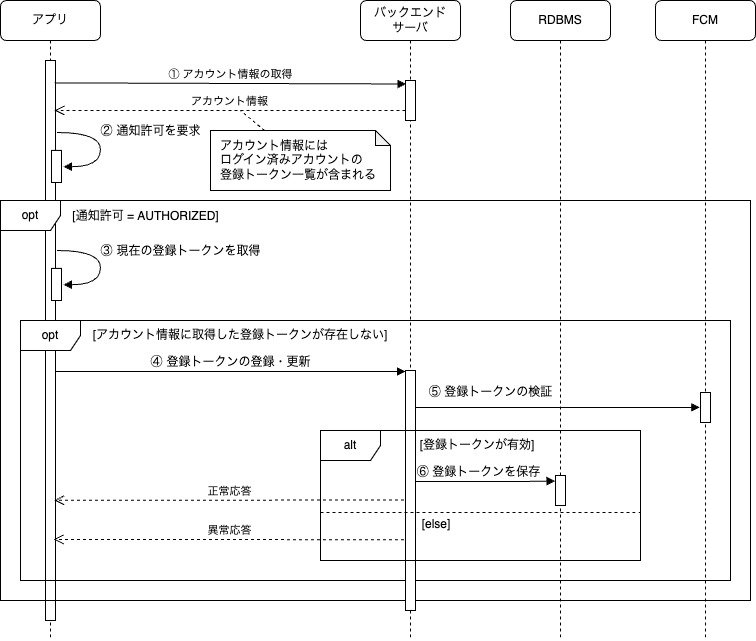

ログイン時に登録トークンを登録・更新します。
登録・更新する条件は次の通りです。

- 通知が許可されている
- アカウント情報の登録トークン一覧に現在の登録トークンがない

## 処理フロー

処理フローは以下になります。

| No | 処理 | 内容 |
|:--|:--|:--|
| ① | アカウント情報の取得 |  アカウント情報取得APIを呼び出して、ログイン済みアカウントに紐づく登録トークン一覧を取得します。登録トークン一覧に現在の登録トークンがない場合、登録または更新が必要です。登録トークンの定期的な更新を促すため、登録日時が1か月以上前の登録トークンはレスポンスに含まれません。 |
| ② | 通知許可を要求 | 通知許可を要求します。Androidの場合この検証は常に有効となります。iOSの場合、初回のみ通知許可の確認ダイアログが表示されます。|
| ③ | 現在の登録トークンを取得 | 通知許可が有効（AUTHORIZED）な場合、現在の登録トークンを取得します。 |
| ④ | 登録トークンを再生成 | レスポンスの登録トークン一覧に現在の登録トークンがない場合、登録トークンを新たに生成します。|
| ⑤ | 登録トークンの更新 | 新たに生成した登録トークンを登録・更新します。登録トークン更新APIでは、更新前と更新後の登録トークンをリクエストで指定します。更新前に現在の登録トークンを、更新後に再生成した登録トークンを指定して登録トークン更新APIを呼び出します。 |
| ⑥ | 登録トークンの削除 | 更新前の登録トークンをデータベースから削除します。 |
| ⑦ | 登録トークンの検証 | 更新後の登録トークンをデータベースへ保存する前に、登録トークンが有効な値かを検証します。検証はdryRunオプションをtrueにしてFCMへプッシュ通知を送信することで行います。dryRunオプションがtrueの場合、端末に通知は行わず検証のみが実施されます。 |
| ⑧ | 登録トークンの検証 | 更新後の登録トークンが有効な場合、データベースへ保存します。 |
