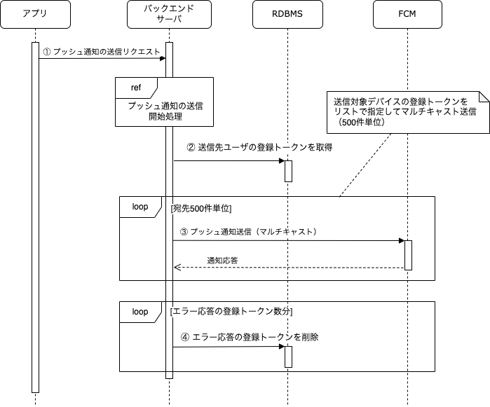

バックエンドサーバがFCMと連携することでプッシュ通知を送信します。
ここではアプリから特定のユーザにプッシュ通知を送信するフローを例として説明します。

## 処理フロー

処理フローは以下になります。

| No | 処理 | 内容 |
|:--|:--|:--|
| ① | プッシュ通知の送信リクエスト | アプリがバックエンドサーバにプッシュ通知の送信をリクエストします。リクエストとして送る情報には、プッシュ通知の送信先ユーザのアカウントを特定する情報を含めます。 |
| ② | 送信先ユーザの登録トークンを取得 | 送信先ユーザのアカウントに紐づく登録トークンを取得します。アカウントに紐づく登録トークンが複数ある場合、その全てが通知対象となります。|
| ③ | プッシュ通知送信（マルチキャスト） | マルチキャスト送信を用いて複数の宛先へ同時にメッセージを送信します。マルチキャスト送信は1回のリクエストで最大500件までのメッセージを送信できます。宛先が500デバイスを超える場合は、複数回のリクエストに分けて送信します。 |
| ④ | エラー応答の登録トークンを削除 | 通知の送信時にUNREGISTERDのエラーを受け取った場合、無効な登録トークンとして判断し、データベースから削除します。|

## 送信情報

このアプリでは、用途に応じて以下の内容のプッシュ通知を送信します。

- 通知表示内容：用途に応じた内容
- 通知データ：用途に応じたデータ
  - 受信した通知の種類によってアプリの遷移先を変更したい場合などは、通知の種別を表す値を含める
- 通知チャンネル：用途に応じたチャンネル
- 優先度：高（スリープ状態を解除する）
- 有効期限：12時間
- 折りたたみ：アプリ単位で集約（デフォルト）
- その他の設定：デフォルト

## 送信処理の非同期制御

プッシュ通知の送信は、その特性や効率性およびエラー発生時の再送制御を考慮し、本来であれば非同期で実装するのが望ましいです。
このアプリでは、クライアント側となるモバイルアプリのサンプルを充実させることに注力しているため、簡易的に同期処理でプッシュ通知を実装します。

## レート制限

FCMにおけるプッシュ通知の送信レート制限については、
[FCM メッセージについて](https://firebase.google.com/docs/cloud-messaging/concept-options?hl=ja#throttling-and-scaling)
のドキュメント内に記載されています。

主な制限は以下のとおりです。

- 1台のデバイスに送信できるメッセージ
  - 1分あたり最大240件
  - 1時間あたり最大5000件
- アップストリームメッセージの制限
  - プロジェクトあたり1500000件/分
  - デバイスあたり1000件/分

これを超える送信レートで送信リクエストを送った場合は、FCMから429 QUOTA_EXCEEDEDのエラー応答が返されます。

FCMから429 QUOTA_EXCEEDEDが返ってきた場合には、後述するエラー発生時の処理に従います。

## エラー発生時の処理

FCMから無効なトークンのエラー応答が返ってきた場合は登録トークンを削除します。 その他のエラーについては、通知送信の失敗とその理由をログに記録した上で、通知のユースケースごとにその後のハンドリング内容を検討します。このアプリでは、クライアント側となるモバイルアプリのサンプルを充実させることに注力しているため、 エラー発生時の再送制御は実装しないものとします。
