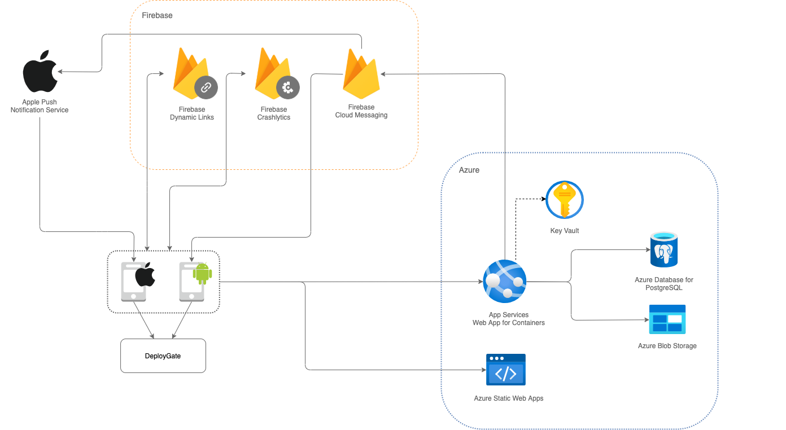

このアプリでは、HTTP APIや利用規約などの静的ファイルのホスティングにAzureのサービスを利用します。また、Push通知やディープリンク、ログの管理などにFirebaseのサービスも利用します。

[ビルドバリアント](/react-native/santoku/development/build-configuration/build-variants.mdx)に応じて、使用するAzureのリソースグループやFirebaseのプロジェクトを切り替えます。

## ローカル環境のシステム構成

開発は基本的にローカル環境で実施します。ローカル環境の場合、バックエンド環境はモックサーバを利用します。

## AzureやFirebaseを使用した場合のシステム構成

このアプリを配布する場合や、Azure、Firebaseのサービスと接続してテストする場合は、以下の構成になります。
Firebaseの機能を利用する際は、こちらの[注意点](react-native/santoku/development/implement/cautions-on-using-firebase.mdx)を参照してください。

