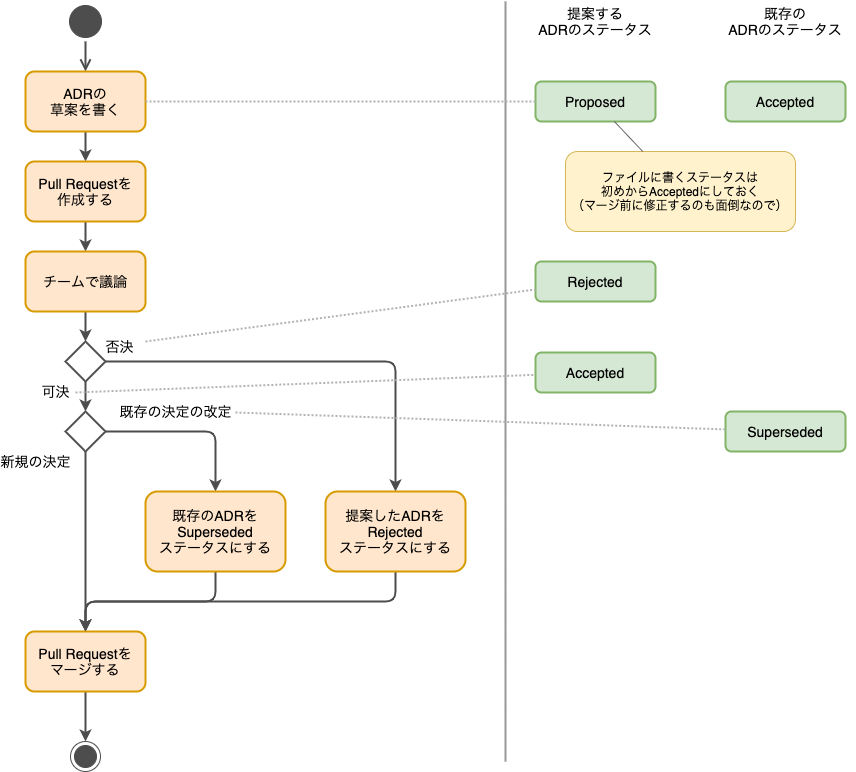

Status: Accepted

<!--
Proposed: 提案中
Accepted: 採用
Rejected: 却下
Superseded: 廃止
-->

## 要約

ADRのフォーマットを利用して、アーキテクチャや機能要件に関する決定ログを残します。**一度決定したらその変更に大きなコストがかかるもの**は、検討過程を含めて、決定のログを残すことにします。

ADRのファイル名は`adr-<seq>-<title>.mdx`とし、テンプレートとして[_decision-record-template](_decision-record-template.mdx)を利用してください。

ADRを提案する際は、Statusを「Accepted」としてPull Requestを作成してください。マージされたら、ADRが採用されたと考えます。

## コンテキスト

サンプルアプリケーションと似たコンテキストでプロジェクトが何か決定したいときに、どのように検討されたか記録が残っていることが役に立つ  と考えています。

そのため、実際のプロジェクトでも決断が難しなりそうな決定については、どのように検討したかのログを残したいと考えています。

## 議論

### ADRのフォーマットについて

いくつかの参考ページの情報を元に、フォーマットを検討しました。

* [Architecture Decision Records導入事例 \| Fintan](https://fintan.jp/?p=3578)
* [実践ADR](https://scrapbox.io/kawasima/%E5%AE%9F%E8%B7%B5ADR)

残す項目があまり多すぎてもメンテナンスしていけなくなってしまうと考えて、次の5項目に絞りました。

* タイトル
  * 決定したいことを端的に表現したタイトル
* 要約
  * ADRの内容を要約して、3行程度で記載
* コンテキスト
  * この決定や変更をしなくてはいけない状況や問題などを説明
* 議論
  * 解決方法や選択肢について検討・議論した内容
* 決定
  * 最終的な決定内容

どういった状況で、何を議論して、どのように決定したのかが記録されていれば、参考にしやすいと考えました。

### いつADRを書くか

参考ページに記載してあるままですが、「一旦決定したら、その変更には大きなコストがかかるもの」をADRの対象とします。

例えば、次のようなものを考えています。

* アプリケーションアーキテクチャの決定
* 機能横断要件の実現方法
* 開発ガイド（設計・実装）でガイドする内容
* 開発ツールやライブラリ、コストなどとのトレードオフでの機能要件の取下げや縮小

### どのようにADRを運用するか

次のフローチャートのように運用します。

:::note
草案を書いてPull Requestを作成した段階では、「決定」の後には記載がなくても大丈夫です。
:::

## 決定

T.B.W.
