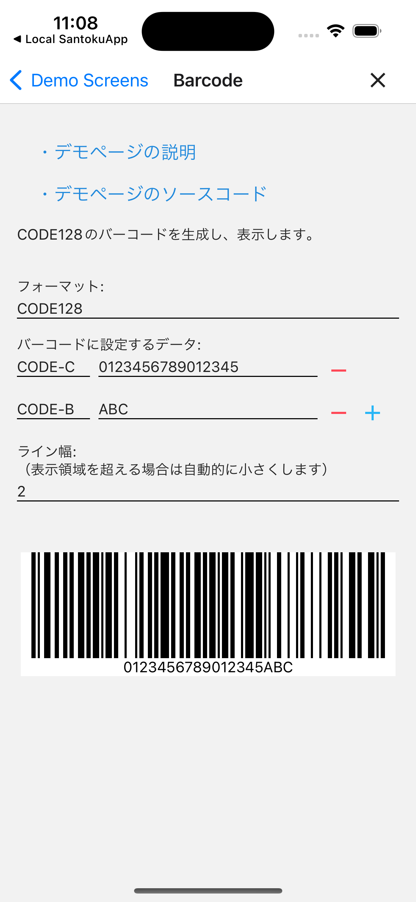
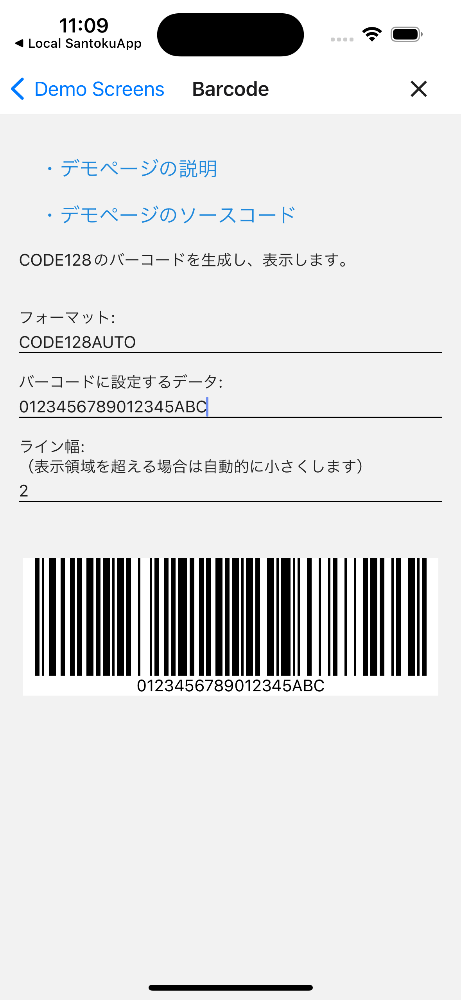

# バーコード

## 概要

バーコードの生成、表示を検証するデモページです。

このページのソースコードは[こちら](https://github.com/{@inject:organization}/mobile-app-crib-notes/tree/master/example-app/SantokuApp/src/features/demo-barcode)です。

## 用語

| 用語 | 説明 |
|:--|:--|
| CODE128 | バーコードには様々な種類がありますが、CODE128は全てのASCIIコードを扱えるバーコードです。このアプリでは、現在CODE128のみをサポートしています。 |
| スタートキャラクタ | データの始まりを表す文字です。CODE128には、3種類のスタートキャラクタがあります。 ・CODE-A ・CODE-B ・CODE-C スタートキャラクタで指定するキャラクタによって、以降のデータで指定できる文字が変わります。また、CODE-Cは一つのバーパターンで2桁の数字を表すことができるため、バーの本数を少なくできます。 |
| コードセットキャラクタ | データの途中でスタートキャラクタで指定したキャラクタを変更できます。コードセットキャラクタに指定できるのは、スタートキャラクタと同様の3種類です。 |

## バーコード生成、表示

バーコードを生成し、表示します。

バーコード生成時のフォーマットとして以下の2つを選択できます。

| フォーマット | 説明 |
|:--|:--|
| CODE128 | スタートキャラクタやコードセットキャラクタを自身で設定するフォーマットです。 |
| CODE128AUTO | 指定されたデータに応じて自動でスタートキャラクタやコードセットキャラクタを設定するフォーマットです。 |

### バーコードのイメージ

| CODE128 | CODE128AUTO |
|:--|:--|
|||
