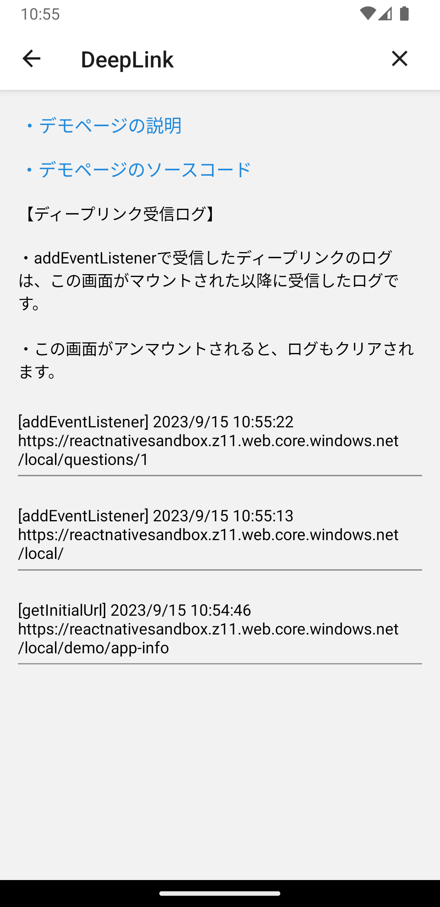

# ディープリンク

## 概要

このアプリで受け取ったディープリンクを確認できるページです。

このページのソースコードは[こちら](https://github.com/{@inject:organization}/mobile-app-crib-notes/tree/master/example-app/SantokuApp/src/features/demo-deep-link)です。

### 画面イメージ

## ディープリンクに使用するドメイン

このアプリでは、ディープリンクのドメインとして以下を登録しています。

- [https://reactnativesandbox.z11.web.core.windows.net](https://reactnativesandbox.z11.web.core.windows.net)

上記ドメインの`.well-known`に`apple-app-site-association`と`assetlinks.json`を配置しています。

- [apple-app-site-association](https://reactnativesandbox.z11.web.core.windows.net/.well-known/apple-app-site-association)
- [assetlinks.json](https://reactnativesandbox.z11.web.core.windows.net/.well-known/assetlinks.json)

## ディープリンクのパス一覧

このアプリで登録しているパスの一覧です。ここに記載されていないパスにアクセスした場合は、ブラウザでそのURLが開かれます。

| パス                                                                                                 | Navigation action | 説明                                                     |
|:---------------------------------------------------------------------------------------------------|:------------------|:-------------------------------------------------------|
| [/](https://reactnativesandbox.z11.web.core.windows.net)                                           | -                 | アプリを起動するだけで画面遷移はしません。                                  |
| [/home](https://reactnativesandbox.z11.web.core.windows.net/home)                                  | NAVIGATE          | ホーム画面に遷移します。                                           |
| [/questions/:questionId](https://reactnativesandbox.z11.web.core.windows.net/questions/1) （※１） | PUSH              | 質問詳細画面に遷移します。ただし、パスパラメータが指定されていない場合や数値以外の場合は画面遷移はしません。 |
| [/demo/app-info](https://reactnativesandbox.z11.web.core.windows.net/demo/app-info)                | PUSH              | デモのApplication Information画面に遷移します。                    |
（※１）リンクは、`questionId`に固定で1を設定しています（URLのパスは`/questions/1`になります）。

`prod`以外の環境では、パスのプレフィックスに環境名を付けます。

| 環境名   | パス                                                                                                             |
|:------|:---------------------------------------------------------------------------------------------------------------|
| stg   | [/stg/](https://reactnativesandbox.z11.web.core.windows.net/stg/)                                              |
|       | [/stg/home](https://reactnativesandbox.z11.web.core.windows.net/stg/home)                                      |
|       | [/stg/questions/:questionId](https://reactnativesandbox.z11.web.core.windows.net/stg/questions/1) （※１）     |
|       | [/stg/demo/app-info](https://reactnativesandbox.z11.web.core.windows.net/stg/demo/app-info)                    |
| dev   | [/dev/](https://reactnativesandbox.z11.web.core.windows.net/dev/)                                              |
|       | [/dev/home](https://reactnativesandbox.z11.web.core.windows.net/dev/home)                                      |
|       | [/dev/questions/:questionId](https://reactnativesandbox.z11.web.core.windows.net/dev/questions/1) （※１）     |
|       | [/dev/demo/app-info](https://reactnativesandbox.z11.web.core.windows.net/dev/demo/app-info)                    |
| local | [/local/](https://reactnativesandbox.z11.web.core.windows.net/local/)                                          |
|       | [/local/home](https://reactnativesandbox.z11.web.core.windows.net/local/home)                                  |
|       | [/local/questions/:questionId](https://reactnativesandbox.z11.web.core.windows.net/local/questions/1) （※１） |
|       | [/local/demo/app-info](https://reactnativesandbox.z11.web.core.windows.net/local/demo/app-info)                |
（※１）リンクは、`questionId`に固定で1を設定しています（URLのパスは`/questions/1`になります）。
