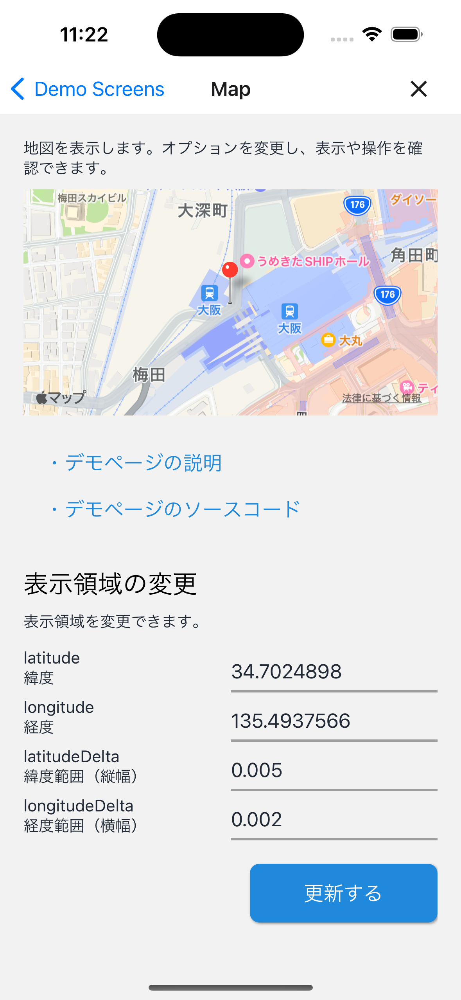
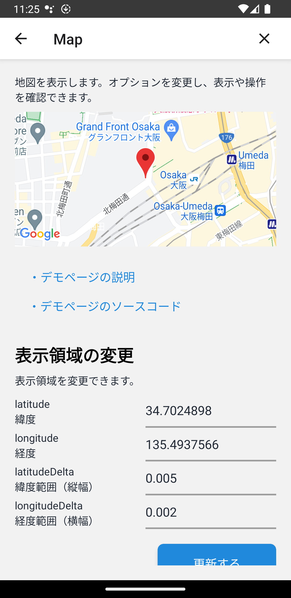

# 地図表示

## 概要

地図表示を検証するデモページです。

このページのソースコードは[こちら](https://github.com/{@inject:organization}/mobile-app-crib-notes/tree/master/example-app/SantokuApp/src/features/demo-map)です。

## 検証できること

### 表示領域の変更

表示位置と表示範囲を変更できます。

- latitude: 緯度
- longitude: 経度
- latitudeDelta: 緯度範囲（縦幅）
- longitudeDelta: 経度範囲（横幅）

地図の表示領域内にlatitudeDeltaとlongitudeDeltaで指定した範囲の両方が収まるように地図が表示されます。

### 地図の種類選択

地図の見た目を変更できます。

- MapType: 地図タイプ
  - standard: 道路地図
  - satellite: 航空写真
  - hybrid: 航空写真に道路地図を重ねたもの
- showBuildings: 建物の輪郭を表示

showBuildingsの設定値（true/false）で建物の輪郭表示の切り替えができたのは、iOSのバージョン15以下だけです。

以下にエミュレータ・シミュレータでOSのバージョンごとに検証した結果を示します。

#### Android

| バージョン | 建物の輪郭 |
|:----- |:----- |
| 13.0 | showBuildingsの設定値に関わらず常に表示する |
| 12.0 | showBuildingsの設定値に関わらず常に表示する |
| 11.0 | showBuildingsの設定値に関わらず常に表示する |

#### iOS

| バージョン | 建物の輪郭 |
|:----- |:----- |
| 16.2 | showBuildingsの設定値に関わらず常に表示する |
| 15.4 | showBuildingsの設定値を反映する |
| 14.5 | showBuildingsの設定値を反映する |

### 画面操作の制限

以下の画面操作を制限できます。

- scrollEnabled: スクロールを許可
- zoomEnabled: 拡大縮小を許可
- rotateEnabled: 回転を許可
- pitchEnabled: 視点の角度変更を許可

### マーカーの追加

以下の項目に値を指定しマーカーを追加できます。

- latitude: 緯度
- longitude: 経度
- title: タイトル
- description: 説明
- draggable: ドラックアンドドロップによる位置変更を許可

タイトルと説明を両方入力しなかった場合、タップしてもコールアウトは表示されません。

## 使用したマップSDK

地図表示のためにreact-native-mapsを使用します。

react-native-mapsで使用できるマップSDKは以下になります。

- [MapKit（iOS）](https://developer.apple.com/documentation/mapkit/)
- [Google Maps（iOS/Android）](https://developers.google.com/maps/documentation/ios-sdk?hl=ja)

ただし、iOSではGoogle Mapsの使用に制限があります。
詳細は、[iOSでGoogle Mapsを使用するときの注意点](#iosでgoogle-mapsを使用するときの注意点)を参照してください。

そのため、このアプリではiOSはMapKit、AndroidはGoogle Mapsを使用した地図表示のみ対応しています。

### AndroidでGoogle Mapsを使用する場合に必要な設定

Google Maps APIを使用するためのAPIキーが必要になります。
Google Mapsを使用する場合は、以下を参考にAPIキーを取得してください。

- [APIキーを使用する | Map SDK for Android | Google Developers](https://developers.google.com/maps/documentation/android-sdk/get-api-key?hl=ja)

取得したAPIキーを、`~/.gradle/gradle.properties`に設定します。

```properties
SANTOKU_APP_GOOGLE_MAP_API_KEY=[取得したAPIキー]
```

### iOSでGoogle Mapsを使用するときの注意点

このアプリで作成している地図表示の共通部品（[MapView](https://github.com/{@inject:organization}/mobile-app-crib-notes/tree/master/example-app/SantokuApp/src/bases/ui/map/MapView.tsx)）ではiOSでGoogle Mapsを使うことはできない仕様になっています。
iOSでGoogle Mapsを使用する場合、共通部品は使用せず`react-native-maps`からコンポーネントをインポートしてください。
さらに、設定ファイルの変更が必要になります。

以下を参考にAPIキーを取得してください。

- [APIキーを使用する | Map SDK for iOS | Google Developers](https://developers.google.com/maps/documentation/ios-sdk/get-api-key?hl=ja)

`app.config.js`に取得したAPIキーを追記してください。

```diff title="/app.config.js"
module.exports = ({config}) => {
  const environment = process.env.ENVIRONMENT ?? 'prod';
  const defaultAppConfig = {
    /* ～省略～ */
    ios: {
      /* ～省略～ */
+     config: {
+       googleMapsApiKey: '<Your API Key>',
      }
    },
/* ～省略～ */
```

- [app.json / app.config.js - Expo Documentation](https://docs.expo.dev/versions/latest/config/app/#googlemapsapikey)

このアプリではFirebaseを使用しているため、useFrameworksで静的リンクを明示的に指定しています。

- [Configure Firebase with iOS credentials | React Native Firebase](https://rnfirebase.io/#altering-cocoapods-to-use-frameworks)

しかしreact-native-mapsの`1.3.2`はuseFrameworksに対応していません。
iOSでGoogle Mapsを使用する設定でビルドしたとき依存関係にあるファイルが見つからないというエラーが発生します。

- ['RCTConvert+AirMap.h' file not found・Issues #3597 | GitHub](https://github.com/react-native-maps/react-native-maps/issues/3597)
- [use_frameworks! issues with react-native-maps RN 0.69.3 | GitHub](https://github.com/react-native-maps/react-native-maps/discussions/4389)

そのため、このアプリではiOSでGoogle Mapsを表示できない仕様としています。

なお、`react-native-maps`の`1.6.0`からは、useFrameworksの静的リンクに対応しているようです。

- [CHANGELOG](https://github.com/react-native-maps/react-native-maps/blob/master/CHANGELOG.md#160-2023-04-20)
- [fix(ios): support for `use_frameworks! :linkage => :static`](https://github.com/react-native-maps/react-native-maps/commit/b0c2d42454ef72ff2037103218f799801aa83ebf)

## 地図表示のイメージ

| iOS | Android |
|:--|:--|
|||
