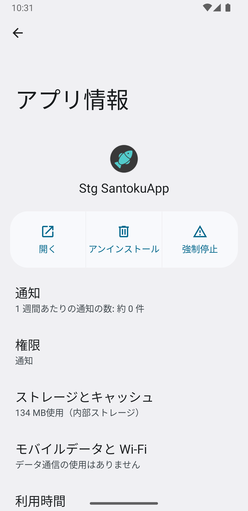
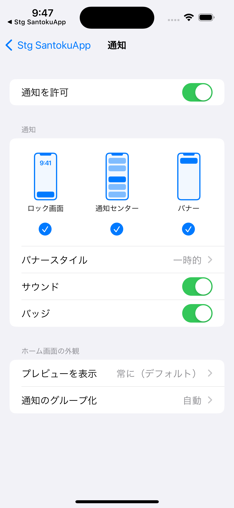

# プッシュ通知

## 概要

プッシュ通知の機能を検証するデモページです。

- プッシュ通知の送信
- プッシュ通知の許可状態取得
- プッシュ通知受信の許可ダイアログ表示
- プッシュ通知受信の仮許可
- プッシュ通知の設定画面への遷移

このページのソースコードは[こちら](https://github.com/{@inject:organization}/mobile-app-crib-notes/tree/master/example-app/SantokuApp/src/features/demo-push-notification)です。

## 用語

| 用語 | 説明 |
|:--|:--|
| ヘッドアップ通知 | プッシュ通知を受信した際に、画面上部のバナーに表示される通知です。端末がロックされている状態では表示されません。 |
| 通知センター | 画面上部をスワイプすることで表示される通知の履歴を確認できる領域です。Androidでは通知ドロワーと呼びます。このドキュメントでは、iOS、Android共に通知センターと表現します。 |

## プッシュ通知の送信

バックエンドのAPIを実行してプッシュ通知を送信します。
プッシュ通知を送信するバックエンドのソースコードは[こちら](https://github.com/{@inject:organization}/mobile-app-crib-notes/tree/master/example-app/santoku-app-backend/src/main/java/jp/fintan/mobile/santokuapp/infrastructure/service/FcmPushNotifier.java)です。

プッシュ通知を送信するパラメータとして、以下の項目を画面から指定できます。

| 項目                                                                                                                                                       | 概要                                                                                                                                                                                                                                                                                                                                                                                                                                                                                                                                                                                                               |
|:---------------------------------------------------------------------------------------------------------------------------------------------------------|:-----------------------------------------------------------------------------------------------------------------------------------------------------------------------------------------------------------------------------------------------------------------------------------------------------------------------------------------------------------------------------------------------------------------------------------------------------------------------------------------------------------------------------------------------------------------------------------------------------------------|
| [通知タイトル](https://firebase.google.com/docs/reference/fcm/rest/v1/projects.messages#Notification.FIELDS.title) | 通知のタイトルです。ヘッドアップ通知や通知センターの履歴に表示されます。                                                                                                                                                                                                                                                                                                                                                                                                                                                                                                                                                                             |
| [通知ボディ](https://firebase.google.com/docs/reference/fcm/rest/v1/projects.messages#Notification.FIELDS.body) | 通知のボディです。ヘッドアップ通知や通知センターの履歴に表示されます。                                                                                                                                                                                                                                                                                                                                                                                                                                                                                                                                                                              |
| [データ属性（複数可）](https://firebase.google.com/docs/reference/fcm/rest/v1/projects.messages#Message.FIELDS.data) | 任意のキーと値を設定できます。データ属性のみを指定した場合は、ヘッドアップ通知や通知センターの履歴に表示されません。                                                                                                                                                                                                                                                                                                                                                                                                                                                                                                                                                       |
| [バッジ（iOS）](https://developer.apple.com/documentation/usernotifications/setting_up_a_remote_notification_server/generating_a_remote_notification#2943360) | アプリアイコンに表示されるバッジです。ここで設定した数値がアプリアイコンに表示されます。                                                                                                                                                                                                                                                                                                                                                                                                                                                                                                                                                                     |
| [collapse-id（iOS）](https://developer.apple.com/documentation/usernotifications/setting_up_a_remote_notification_server/sending_notification_requests_to_apns#2947607)  | 複数の通知を一つにまとめる識別子です。同じ識別子で送信された複数の通知は、通知センターの履歴に一つだけ表示されます。                                                                                                                                                                                                                                                                                                                                                                                                                                                                                                                                                       |
| [content-available（iOS）](https://developer.apple.com/documentation/usernotifications/setting_up_a_remote_notification_server/generating_a_remote_notification#2943360)  | バックグラウンド通知を有効にするかのフラグです。                                                                                                                                                                                                                                                                                                                                                                                                                                                                                                                                                                                         |
| [Priority（iOS）](https://developer.apple.com/documentation/usernotifications/setting_up_a_remote_notification_server/sending_notification_requests_to_apns#2947607)  | 通知の優先度です。以下の3つが指定可能です。 ・10: 即時に配信します。 ・5: デバイスの電力を考慮して配信します。 ・1: 配信よりもデバイスの電力を考慮し、デバイスの起動を抑制します。                                                                                                                                                                                                                                                                                                                                                                                                                                                                                                     |
| [InterruptionLevel（iOS）](https://developer.apple.com/documentation/usernotifications/setting_up_a_remote_notification_server/generating_a_remote_notification#2943360) | 通知の重要度と配信タイミングのレベルです。以下の4つが指定可能です。 passive: ヘッドアップ通知は表示されず、音も鳴りません。通知センターの履歴には表示されます。  active: ヘッドアップ通知は表示され、音も鳴ります。しかし、集中モードなどのシステム制御を突破して通知が表示されることはありません。  time-sensitive: ヘッドアップ通知は表示され、音も鳴ります。OSの設定でアプリが許可されていれば、集中モードなどのシステム制御を突破して、通知が表示されます。ただし、`time-sensitive`を使用するためには、Capabilityで`Time Sensitive Notifications`を有効化する必要があります。このアプリでは、`Time Sensitive Notifications`を有効化していません。  critical: ヘッドアップ通知が表示され、音も鳴ります。また、集中モードなどのシステム制御も突破して通知が表示されます。ミュートスイッチをバイパスして音も鳴るため、緊急を要する場合に使用します。ただし、これを使用するにはAppleに承認されたEntitlementが必要です。このアプリでは、`critical`は使用できません。 |
| [RelevanceScore（iOS）](https://developer.apple.com/documentation/usernotifications/setting_up_a_remote_notification_server/generating_a_remote_notification#2943360)  | 0〜1の間の数値を指定できます。最も高い数値の通知が、通知の要約で紹介されます。                                                                                                                                                                                                                                                                                                                                                                                                                                                                                                                                                                         |
| [通知数（Android）](https://firebase.google.com/docs/reference/fcm/rest/v1/projects.messages#AndroidNotification.FIELDS.notification_count) | 通知の件数です。指定した数値が、既存の通知件数に加算されます。                                                                                                                                                                                                                                                                                                                                                                                                                                                                                                                                                                                  |
| [collapse_key（Android）](https://firebase.google.com/docs/reference/fcm/rest/v1/projects.messages#AndroidConfig.FIELDS.collapse_key) | 複数の通知を一つにまとめる識別子です。同じ識別子で送信された複数の通知は、通知センターの履歴に一つだけ表示されます。                                                                                                                                                                                                                                                                                                                                                                                                                                                                                                                                                       |
| [チャンネル（Android）](https://firebase.google.com/docs/reference/fcm/rest/v1/projects.messages#AndroidNotification.FIELDS.channel_id) | 通知を送信するチャンネルです。                                                                                                                                                                                                                                                                                                                                                                                                                                                                                                                                                                                                  |

アプリがフォアグラウンドにある場合は、アプリが用意しているスナックバーに通知内容を表示します。
アプリがバックグラウンドにある場合、もしくはアプリを起動していない場合は、OSによって挙動が変わります。

iOSの場合は、ヘッドアップ通知が表示され、音が鳴ります。

Androidの場合は、チャンネルの重要度によって挙動が変わります。このアプリが用意しているチャンネルと重要度は以下になります。

| チャンネル | 重要度 | 通知の動作 |
|:--|:--|:--|
| emergencyChannel | 緊急 | 音が鳴り、ヘッドアップ通知として表示されます。 |
| highChannel | 高 | 音が鳴ります。 |
| middleChannel | 中 | 音が鳴りません。 |
| lowChannel | 低 | 音が鳴らず、ステータスバーにも表示されません。 |

チャンネルを指定しないでプッシュ通知を送信した場合は、`emergencyChannel`に通知されます。

プッシュ通知送信時のパラメータの詳細に関しては、以下のドキュメントを参考にしてください。

- [Firebase - FCM REST API](https://firebase.google.com/docs/reference/fcm/rest/v1/projects.messages)
- [Apple - Generating a remote notification](https://developer.apple.com/documentation/usernotifications/setting_up_a_remote_notification_server/generating_a_remote_notification)
- [Apple - Sending notification requests to APNs](https://developer.apple.com/documentation/usernotifications/setting_up_a_remote_notification_server/sending_notification_requests_to_apns)

## Permissionのステータス取得

現在のPermissionのステータスを取得します。

iOSの場合は、以下4つのステータスが存在します。

| ステータス | 説明 |
|:--|:--|
| NOT_DETERMINED | ユーザが許可ダイアログでプッシュ通知受信を許可、もしくは拒否をしていない状態 |
| DENIED | ユーザが許可ダイアログでプッシュ通知受信を拒否した場合 |
| AUTHORIZED | ユーザが許可ダイアログでプッシュ通知受信を許可した場合 |
| PROVISIONAL | アプリがPROVISIONALとしてプッシュ通知受信の許可リクエストを実施した場合 |

Androidの場合は、常に`AUTHORIZED`となります。

## プッシュ通知受信の許可ダイアログの表示

iOSの場合は、ダイアログを表示してユーザにプッシュ通知受信の許可を確認する必要があります。
Permissionの確認をする前にプッシュ通知を送信しても、ユーザはその通知を受信できません。

なお、一度でもプッシュ通知受信を許可もしくは拒否した場合は、以降許可ダイアログは表示されません。

### 許可ダイアログのイメージ

## プッシュ通知受信の仮許可

iOS12以降の場合は、上述した許可ダイアログでユーザが許可をしなくても、プッシュ通知を受信できる機能があります。
プッシュ通知受信のリクエスト時（許可ダイアログ表示リクエスト時）に[provisional](https://rnfirebase.io/messaging/ios-permissions#permission-settings)を設定すると、
許可ダイアログは表示されずステータスが`PROVISIONAL`になります。

ステータスが`PROVISIONAL`の場合はプッシュ通知を受信できます。プッシュ通知を受信した際にヘッドアップ通知は表示されませんが、通知センターには表示されるようになります。
なお、一度でもユーザが許可ダイアログで許可もしくは拒否すると、それ以降はステータスを`PROVISIONAL`に変更できなくなります。

### 受信時のイメージ

| アプリの状態 | iOS | Android |
|:--|:--|:--|
|アプリがフォアグラウンドにある場合のプッシュ通知受信|||
|アプリがバックグラウンドにある場合、もしくはアプリが停止中の場合のプッシュ通知受信 （Androidは`emergencyChannel`に送信）|||
|アプリがバックグラウンドにある場合、もしくはアプリが停止中の場合のプッシュ通知受信 （Androidの`highChannel`に送信）|-||

## プッシュ通知の設定画面への遷移

OSのアプリ設定画面に遷移します。
ユーザは、アプリの設定画面に表示されている通知メニューをタップすることで、プッシュ通知の設定画面に遷移できます。

### アプリの設定画面のイメージ

| 画面 | iOS | Android |
|:--|:--|:--|
| アプリの設定画面 |||
| プッシュ通知の設定画面 |||
