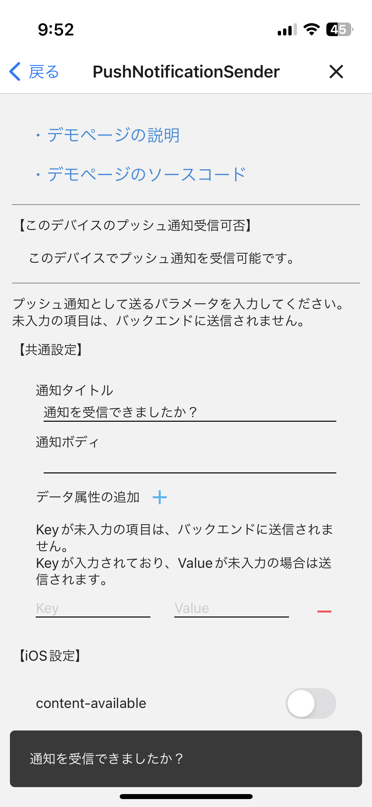
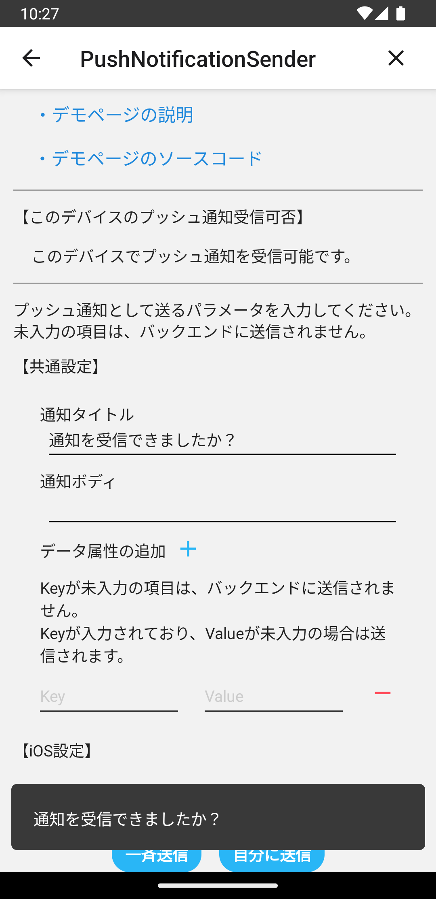
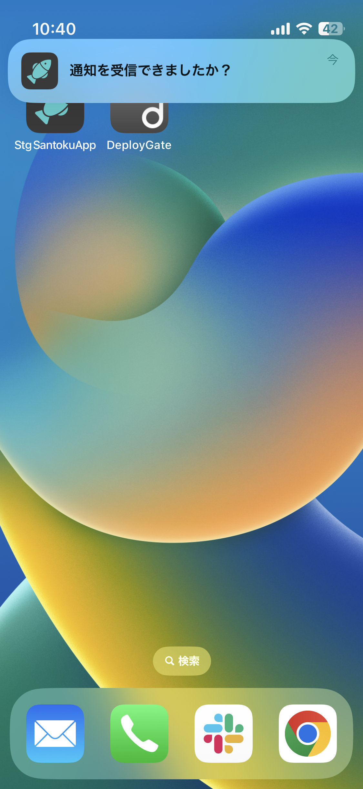

# プッシュ通知

## 概要

プッシュ通知の機能を検証するデモページです。

- プッシュ通知の許可状態取得
- プッシュ通知受信の許可ダイアログ表示
- プッシュ通知受信の仮許可
- プッシュ通知の送信
- プッシュ通知の設定画面への遷移

このページのソースコードは[こちら](https://github.com/{@inject:organization}/mobile-app-crib-notes/tree/master/example-app/SantokuApp/src/features/demo-push-notification)です。

## 用語

| 用語 | 説明 |
|:--|:--|
| ヘッドアップ通知 | プッシュ通知を受信した際に、画面上部のバナーに表示される通知です。端末がロックされている状態では表示されません。 |
| 通知センター | 画面上部をスワイプすることで表示される通知の履歴を確認できる領域です。Androidでは通知ドロワーと呼びます。このドキュメントでは、iOS、Android共に通知センターと表現します。 |

## Permissionのステータス取得

現在のPermissionのステータスを取得します。

iOSの場合は、以下4つのステータスが存在します。

| ステータス | 説明 |
|:--|:--|
| NOT_DETERMINED | ユーザが許可ダイアログでプッシュ通知受信を許可、もしくは拒否をしていない状態 |
| DENIED | ユーザが許可ダイアログでプッシュ通知受信を拒否した場合 |
| AUTHORIZED | ユーザが許可ダイアログでプッシュ通知受信を許可した場合 |
| PROVISIONAL | アプリがPROVISIONALとしてプッシュ通知受信の許可リクエストを実施した場合 |

Androidの場合は、常に`AUTHORIZED`となります。

## プッシュ通知受信の許可ダイアログの表示

iOSの場合は、ダイアログを表示してユーザにプッシュ通知受信の許可を確認する必要があります。
Permissionの確認をする前にプッシュ通知を送信しても、ユーザはその通知を受信できません。

なお、一度でもプッシュ通知受信を許可もしくは拒否した場合は、以降許可ダイアログは表示されません。

### 許可ダイアログのイメージ

## プッシュ通知受信の仮許可

iOS12以降の場合は、上述した許可ダイアログでユーザが許可をしなくても、プッシュ通知を受信できる機能があります。
プッシュ通知受信のリクエスト時（許可ダイアログ表示リクエスト時）に[provisional](https://rnfirebase.io/messaging/ios-permissions#permission-settings)を設定すると、
許可ダイアログは表示されずステータスが`PROVISIONAL`になります。

ステータスが`PROVISIONAL`の場合はプッシュ通知を受信できます。プッシュ通知を受信した際にヘッドアップ通知は表示されませんが、通知センターには表示されるようになります。
なお、一度でもユーザが許可ダイアログで許可もしくは拒否すると、それ以降はステータスを`PROVISIONAL`に変更できなくなります。

## プッシュ通知の送信

バックエンドのAPIを実行してプッシュ通知を送信します。
プッシュ通知を送信するバックエンドのソースコードは[こちら](https://github.com/{@inject:organization}/mobile-app-crib-notes/tree/master/example-app/santoku-app-backend/src/main/java/jp/fintan/mobile/santokuapp/infrastructure/service/FcmPushNotifier.java)です。

アプリがフォアグラウンドにある場合は、アプリが用意しているスナックバーに通知内容を表示します。
アプリがバックグラウンドにある場合、もしくはアプリを起動していない場合は、OSによって挙動が変わります。

iOSの場合は、ヘッドアップ通知が表示され、音が鳴ります。

Androidの場合は、チャンネルの重要度によって挙動が変わります。このアプリが用意しているチャンネルと重要度は以下になります。

| チャンネル | 重要度 | 通知の動作 |
|:--|:--|:--|
| emergencyChannel | 緊急 | 音が鳴り、ヘッドアップ通知として表示されます。 |
| highChannel | 高 | 音が鳴ります。 |
| middleChannel | 中 | 音が鳴りません。 |
| lowChannel | 低 | 音が鳴らず、ステータスバーにも表示されません。 |

なお、チャンネルを指定しないでプッシュ通知を送信した場合は、`emergencyChannel`に通知されます。

### 受信時のイメージ

| アプリの状態 | iOS | Android |
|:--|:--|:--|
|アプリがフォアグラウンドにある場合のプッシュ通知受信|||
|アプリがバックグラウンドにある場合、もしくはアプリが停止中の場合のプッシュ通知受信 （Androidは`emergencyChannel`に送信）|||
|アプリがバックグラウンドにある場合、もしくはアプリが停止中の場合のプッシュ通知受信 （Androidの`highChannel`に送信）|-||

## プッシュ通知の設定画面への遷移

OSのアプリ設定画面に遷移します。
ユーザは、アプリの設定画面に表示されている通知メニューをタップすることで、プッシュ通知の設定画面に遷移できます。

### アプリの設定画面のイメージ

| 画面 | iOS | Android |
|:--|:--|:--|
| アプリの設定画面 |||
| プッシュ通知の設定画面 |||
