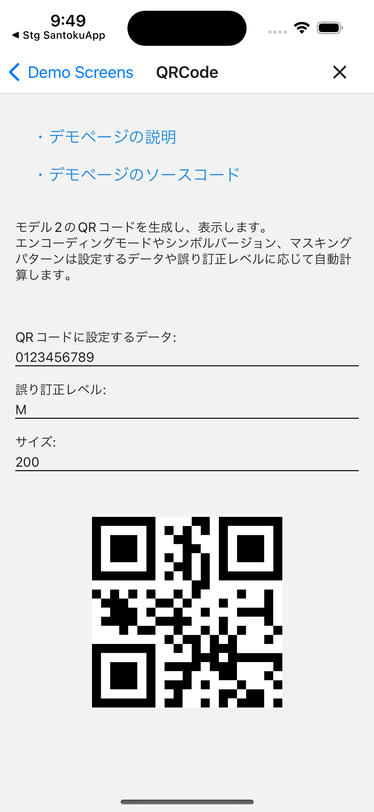

# QRコード

## 概要

QRコードの生成、表示を検証するデモページです。

このページのソースコードは[こちら](https://github.com/{@inject:organization}/mobile-app-crib-notes/tree/master/example-app/SantokuApp/src/features/demo-qrcode)です。

## 用語

| 用語 | 説明 |
|:--|:--|
| 誤り訂正レベル | モバイル端末のディスプレイが汚れている場合などに、QRコードを補正する仕組みです。誤り訂正レベルは、4つのレベルを指定できます。（※括弧内の数値はデータが読み取れなくなる最大の損傷面を表します。） ・L（約7%） ・M（約15%） ・Q（約25%） ・H（約30%） |
| エンコーディングモード | データを効率よく保存するために選択するモード。エンコーディングモードは、4つのモードを指定できます。 ・数字モード ・英数字モード ・バイドモード ・混在モード（上記モードの混在） |
| シンボルバージョン | QRコードには1〜40のバージョンがあり、バージョンの増加に比例して表示されるセル数も増えます。 |
| マスキングパターン | QRコードは2色のセルで表現されますが、片方の色に偏りすぎると読み取り効率が悪くなるため、それらを補正するための仕組みです。マスキングパターンは0〜7のパターンを選択できます。 |

## QRコード生成、表示

モデル2のQRコードを生成し、表示します。

以下の項目は、設定するデータや誤り訂正レベルに応じて自動計算します。

- エンコーディングモード
- シンボルバージョン
- マスキングパターン

### QRコードのイメージ

