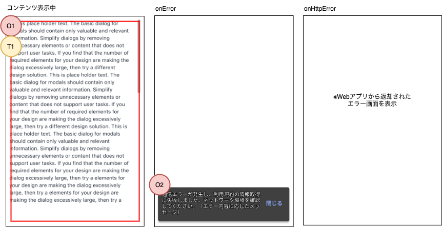

## 概要

このアプリ内で、外部のWebサイトやコンテンツを表示する際に使用するコンポーネントです。 
[React Native WebView](https://github.com/react-native-webview/react-native-webview)を使用し、共通部品として作成します。

## 機能

- 指定されたURLのコンテンツを表示します。
- エラーハンドリングは、[Application Architecture](/react-native/santoku/application-architecture/error-handling/overview.mdx)に準拠します。
  - onError/onHttpError発生時の処理を親画面から渡せます。
- onError発生時には、デフォルトでネットワークの確認を促すメッセージをスナックバーで表示します。 
  スナックバーの表示/非表示、また表示する際のメッセージは、親画面から変更できます。
- コンテンツがスクロール可能な場合、最底部までスクロールした時の処理を、親画面でハンドリングできます。

## 画面レイアウト

※ onErrorとonHttpError時の画面を変更する場合は、個別の画面仕様書に記載します。

## 画面項目

### 表示項目

| 番号 | 名称          | 項目種別    | 取得元               | 表示/活性条件                                 |
|:----|:--------------|:-----------|:--------------------|:--------------------------------------------|
| O1  | 取得したコンテンツ   | WebView    | -（※1）          | コンテンツ取得に成功した場合のみ表示             |
| O2  | エラーメッセージ | [スナックバー](/react-native/santoku/design/screen-specs/common-parts/snackbar/overview.mdx)  | メッセージキー：`app.webview.onError`（※2） | React Native WebViewでonErrorが呼び出された、かつ親画面からプロパティ：onErrorが指定されていない場合のみ表示 |
（※1）[React Native WebViewのプロパティ](https://github.com/react-native-webview/react-native-webview/blob/master/docs/Reference.md#source)で任意のURLを指定できます。 
（※2）親画面から指定されたメッセージがあれば、そちらを優先します。指定がなければデフォルトのメッセージを表示します。

### 操作項目

| 番号 | 名称        | 項目種別    | 操作種別    | 表示/活性条件                               |
|:----|:------------|:-----------|:----------|:-------------------------------------------|
| T1  | 取得したコンテンツ | WebView    | スクロール | -                                           |

## イベント定義

### ライフサイクル

| イベント | 処理概要 |
|:------|:------|
| 初期表示 | 指定されたURLのコンテンツを取得します。|

### ユーザ操作

| イベント | 処理概要 |
|:------|:------|
| コンテンツを一番下までスクロール | プロパティ：onScrollEndで渡された処理を実行します。 初回のみ、プロパティ：onceScrollEndで渡された処理も実行します。 |

## プロパティ

| 名称           | 必須 | 型     | 説明                                                   |
|:--------------|:-----|:-------|:------------------------------------------------------|
| onScrollEnd   | -    | function  | コンテンツを一番下までスクロールした時に実行する処理        |
| onceScrollEnd | -    | function  | 最初にコンテンツを一番下までスクロールした時にのみ実行する処理 |
| onError       | -    | function  | React Native WebViewのonErrorが発生した時に実行する処理 指定がない場合は、後述のエラー発生時の処理に準拠します |
| onHttpError   | -    | function  | React Native WebViewのonHttpErrorが発生した時に実行する処理 指定がない場合は、後述のエラー発生時の処理に準拠します              |

※ React Native WebViewには存在しないプロパティや、デフォルトの動作を提供しているもののみ記載しています。上記以外のプロパティについては[React Native WebViewのAPIリファレンス](https://github.com/react-native-webview/react-native-webview/blob/master/docs/Reference.md)をご参照ください。

## エラー発生時の動作

Application Architectureの[エラーハンドリング](/react-native/santoku/application-architecture/error-handling/overview.mdx)の方針に則り、WebViewを使用する各画面がエラー処理できるようにします。

- ここでは、共通部品としてのデフォルトのエラー処理のみ記載します。画面個別のエラー処理がある場合は、画面側の設計書に記載します。

- [React Native WebView](https://github.com/react-native-webview/react-native-webview)を使用するため、[onError](https://github.com/react-native-webview/react-native-webview/blob/master/docs/Reference.md#onerror)、[onHttpError](https://github.com/react-native-webview/react-native-webview/blob/master/docs/Reference.md#onhttperror)属性を使用してエラーをハンドリングします。

| 属性名             | 用途                               |
| :---------------- | :-------------------------------- |
| `onHttpError`     | WebViewで表示するページを取得する時に、400以上のHTTPステータスコードで返却された場合に呼びだされます。SantokuAppのデフォルトの動作では、エラーの捕捉後に特に処理を実施しません。そのため、Webアプリから返されたエラー画面がそのまま表示されます。 ユーザ向けのエラー画面が返されない場合など、接続先のWebアプリに応じた処理が必要な場合は、個別にエラー処理を実施してください。 |
| `onError`         | WebViewで表示するページを取得する時に、ネットワークエラーなどが発生した場合に呼びだされます。SantokuAppのデフォルトの動作では、ネットワークの確認を促すスナックバーを表示します。また、Firebase Crashlyticsにエラーログを送信します。画面仕様に依存した特別な処理が必要な場合は、個別にエラー処理を実施してください。 |

:::note
`onHttpError`は、Androidの場合APIレベルが23以上のみ使用できます。
:::

:::caution
WebViewで表示するページ内の画像やCSSなどの読み込みに失敗した場合は、`onError`や`onHttpError`ではエラーを捕捉できません。
:::

:::caution
iOSの場合デフォルトタイムアウトは60秒です。Androidの場合はデフォルトタイムアウトがありません。

なお、React Native WebViewはタイムアウトを設定できないため、表示するページとの通信を明示的にキャンセルできません。
:::
