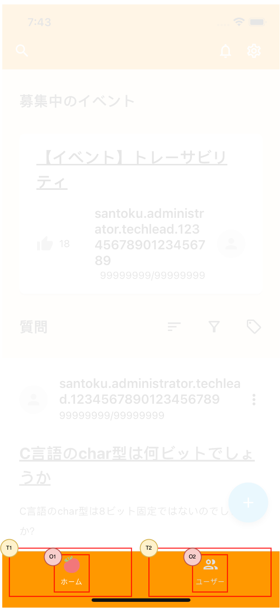

| ID       | 画面種別 |
|:----------|:------------|
| BottomTab | このアプリ全体の画面共通部分となるため、種別は定義しません。 |

## 概要

ユーザが画面の切替を行うタブです。ログイン中かつ画面種別が[Screen](../../../definitions/screen-type/screen.mdx)の場合、常に画面下部に表示されます。

- 切替可能な画面は以下の2つです。
  - ホーム：自チームの当日の時間割を確認できます。
  - チーム：チームの作成や参加、またチームの時間割の編集を行えます。
- タブごとに画面の遷移状況は保持します。タブを切り替えた後、再度元のタブを選択すると、切替当時の画面が表示されます。
- 選択中のタブのアイコンはハイライト表示します。

:::note
ログイン機能は今後開発予定となります。現在は利用規約に同意すればログイン済みとみなします。
:::

:::note
ホーム画面とチーム画面は今後作成する予定のため、それぞれダミー画面を表示します。
:::

## 画面レイアウト

## 画面項目

### 表示項目

| 番号 | 名称          | 項目種別    | 取得元               | 表示/活性条件                                 |
|:----|:--------------|:-----------|:--------------------|:--------------------------------------------|
| O1  | ホームアイコン   | 画像       | -                   | -                                           |
| O2  | チームアイコン   | 画像       | -                   | -                                           |

### 操作項目

| 番号 | 名称        | 項目種別    | 操作種別     | 表示/活性条件                               |
|:----|:------------|:-----------|:----------|:-------------------------------------------|
| T1  | ホームタブ    | タブ       | タップ     |  -                                          |
| T2  | チームタブ    | タブ       | タップ     |  -                                          |

## イベント定義

### ユーザ操作

| イベント | 処理概要 |
|:------|:------|
| ホームタブをタップ | ホームの画面に切り替えます。初めて開く場合は、ホーム画面を表示します。 |
| チームタブをタップ | チームの画面に切り替えます。初めて開く場合は、チーム詳細画面を表示します。 |

:::note
初回切替時に表示する画面は、アカウントのチーム参加状況によって変動します。ホーム/チームの画面は今後作成予定のため、現在は必ず上記の動作となります。
:::
