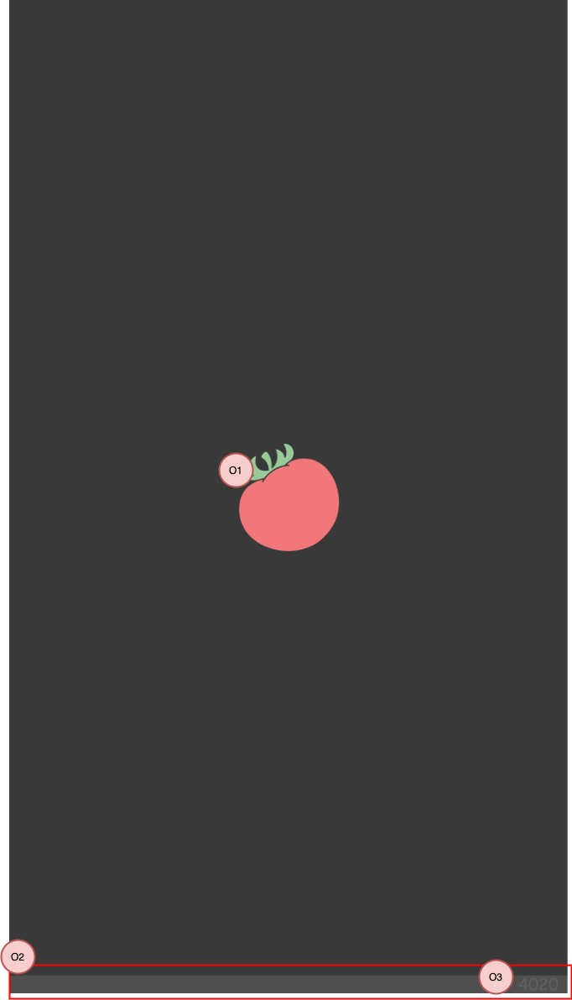

| ID       | 画面種別 |
|:----------|:------------|
| SplashScreen | 起動処理中の画面となるため、種別は定義しません。 |

## 概要

アプリの起動時（※1）に表示される画面です。

- アプリの[初期化処理][]は、この画面の表示中に行います。初期化処理が完了するまで、次の画面には遷移しません。
- 画面サイズに最適化した画像を表示します。各OSで、以下の方針で画像を用意します。
  - Androidのピクセル密度（※2）：ldpi、mdpi、hdpi、xhdpi、xxhdpi、xxxhdpi
  - iOSの画像スケール（※3）：@1x、@2x、@3x

（※1）[アプリスタートの種類](/react-native/santoku/application-architecture/life-cycle-management/overview.mdx#アプリスタートの種類に応じた初期化処理)の、コールドスタートとウォームスタートが該当します。 
（※2）Androidのピクセル密度については、[こちら](https://developer.android.com/training/multiscreen/screendensities?hl=ja)をご参照ください。 
（※3）iOSの画像スケールについては、[こちら](https://developer.apple.com/design/human-interface-guidelines/ios/icons-and-images/image-size-and-resolution/)をご参照ください。

:::note
初期化処理は、今後開発予定です。現在は一部の処理のみ開発対象としております。
:::

## 画面レイアウト

## 画面項目

### 表示項目

| 番号 | 名称           | 項目種別    | 取得元               | 表示/活性条件                                 |
|:----|:--------------|:-----------|:--------------------|:--------------------------------------------|
| O1  | アプリアイコン   | 画像       | -                   | -                                          |
| O2  | フッタ          | 画像       | - | - |
| O3  | コード          | 画像       | - | - |

## イベント定義

### ライフサイクル

| イベント | 処理概要 |
|:------|:------|
| 初期表示 | [初期化処理][]を実施します。 |

:::note
本来は初期化処理にて遷移先の画面を決定し、画面遷移します。しかし、初期化処理および遷移先の画面が今後開発予定のため、現在は常に利用規約同意画面へ遷移します。
:::

## エラー発生時の動作

| エラー | 発生時の動作 |
|:------|:-----------|
| 初期化処理に失敗 | メッセージキー：`app.初期化エラー`をダイアログで表示し、アプリを終了します。（※1） |
（※1）クリティカルエラーの可能性があるため、発生時のログを[Firebase Crashlyticsで収集](/react-native/santoku/application-architecture/logging-app/logging.mdx#firebase-crashlyticsについて)します。

<!-- link定義を使う場合は以下に記載する -->
[初期化処理]: /react-native/santoku/application-architecture/life-cycle-management/initialization.mdx#初期化処理のフロー
