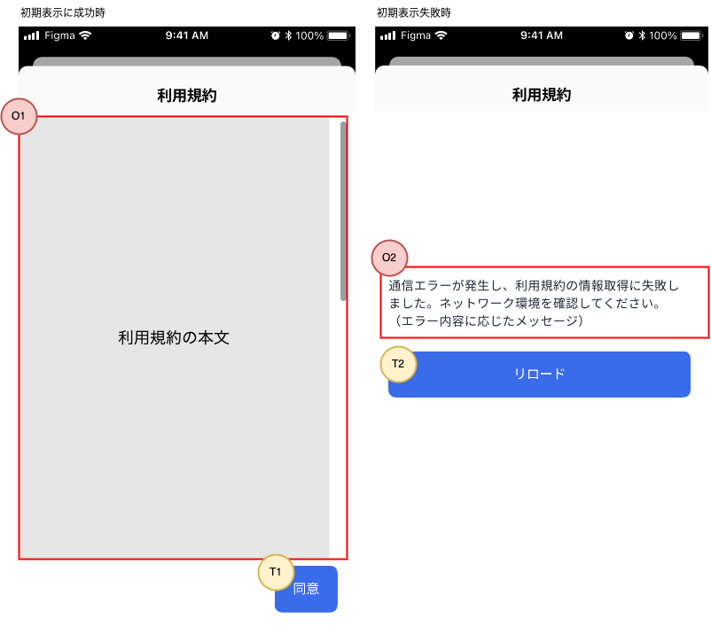

| ID       | 画面種別|
|:----------|:------------|
| TermsOfServiceAgreement | [FormSheet][] |

## 概要

利用規約を表示して、ユーザに同意を求める画面です。アプリの利用には、ユーザの利用規約同意が必要です。

- ユーザは、有効な利用規約に同意する必要があります。有効な利用規約が変更された場合、ユーザに対して利用規約への同意を再度求めます。
  - 有効な利用規約に同意していない場合は、HTTP API通信でエラーとなります。[HTTP API通信で発生するエラーのハンドリング](/react-native/santoku/application-architecture/http-api/http-api-error-handling.mdx)をご参照ください。
- 利用規約は最後まで読んだ上で同意する必要があります。そのため、一度最後まで読まない限り、同意はできないようにします。
- 利用規約の本文は、外部より取得します。外部コンテンツの表示には、共通部品の[WebView][]を使用します。

## 画面レイアウト

## 画面項目（共通）

### ヘッダ

| 位置       | 文言、ボタン  | タップ時の動作          | 表示/活性条件                    |
|:----------|:------------|:---------------------|:--------------------------------|
| タイトル    | 利用規約     | -                    | -                              |
| 右部ボタン  | -           | -                    | -                              |
| 左部ボタン  | -           | -                    | -                              |

## 画面項目（初期表示に成功時）

### 表示項目（初期表示に成功時）

| 番号 | 名称           | 項目種別    | 取得元               | 表示/活性条件                                 |
|:----|:--------------|:-----------|:--------------------|:--------------------------------------------|
| O1  | 利用規約本文     | [WebView][]（※1）| [有効な利用規約の取得API][]のレスポンスに含まれるURL | - |
| O2  | 同意エラーメッセージ | [スナックバー][]（※1）| メッセージキー：`app.terms.同意エラー` | 「エラー：利用規約同意に失敗」が発生した場合に表示 |
（※1）共通部品内の表示条件等は、共通部品の仕様に準拠します。

### 操作項目（初期表示に成功時）

| 番号 | 名称         | 項目種別    | 操作種別  | 表示/活性条件                  |
|:----|:------------|:-----------|:---------|:-------------------------------|
| T1  | 同意ボタン    | ボタン      | タップ    | 利用規約本文を一番下までスクロールしたら活性化 |

## 画面項目（初期表示に失敗時）

### 表示項目（初期表示に失敗時）

| 番号 | 名称           | 項目種別    | 取得元               | 表示/活性条件                                 |
|:----|:--------------|:-----------|:--------------------|:--------------------------------------------|
| O3  | コンテンツ取得エラーメッセージ | ラベル | メッセージキー：`app.ネットワークエラー` パラメータ：`利用規約の取得` | - |

### 操作項目（初期表示に失敗時）

| 番号 | 名称         | 項目種別    | 操作種別  | 表示/活性条件                  |
|:----|:------------|:-----------|:---------|:-------------------------------|
| T2  | リロードボタン | ボタン      | タップ    | - |

## イベント定義

### ライフサイクル

| イベント | 処理概要 |
|:------|:------|
| 初期表示 | [有効な利用規約の取得API][]を呼び出し、利用規約本文を表示します。|

### ユーザ操作

| イベント | 処理概要 |
|:------|:------|
| 同意ボタンをタップ | 同意ボタンにインジケータを表示し、タップできないようにします。 [ログイン済みアカウントの利用規約同意API][]を呼び出し、成功したらホーム画面へ遷移します。 |
| リロードボタンをタップ | コンテンツ取得エラーメッセージとリロードボタンを非表示にします。 [有効な利用規約の取得API][]を呼び出し、利用規約本文を表示します。 |

## API呼出仕様

| API | 呼出に使用するパラメータ |
|:------|:------|
| [有効な利用規約の取得API][] | なし |
| [ログイン済みアカウントの利用規約同意API][] | 同意した利用規約のバージョン：[有効な利用規約の取得API][]で取得したバージョンを使用 |

## エラー発生時の動作

| エラー | 発生時の動作 |
|:------|:------|
| 初期表示に失敗 | 「初期表示に失敗時」のレイアウトになります。WebViewのデフォルト動作ではSnackbarを表示するようになっていますが、この画面ではSnackbarは表示しません。 |
| 利用規約同意に失敗 | 同意ボタンのインジケータを非表示にします。  同意エラーメッセージを表示します。|

<!-- link定義を使う場合は以下に記載する -->
[FormSheet]: /react-native/santoku/design/screen-specs/definitions/screen-type/form-sheet.mdx
[WebView]: /react-native/santoku/design/screen-specs/common-parts/webview/overview.mdx
[スナックバー]: /react-native/santoku/design/screen-specs/common-parts/snackbar/overview.mdx
[有効な利用規約の取得API]: /react-native/santoku/design/api-document#operation/get-terms
[ログイン済みアカウントの利用規約同意API]: /react-native/santoku/design/api-document#operation/post-accounts-me-terms
