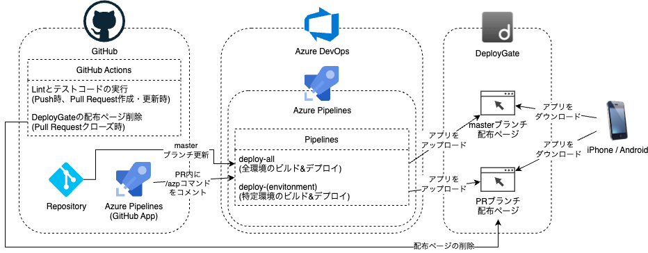

一般的なアプリと同様に、モバイルアプリにおいても自動的にLintやテストコードを実行して早期に問題を検出することは重要です。

またモバイルアプリ開発では、実際にアプリをビルドして端末へ配布できるようにするまでに比較的時間がかかります。
特に開発中のレビューではこの時間が大きなボトルネックとなります。
モバイルアプリのレビューを円滑に進めるためには、開発中のアプリをいつでも端末へインストールできる状態を維持することが望ましいです。
そのため、CI/CDによるビルドとデプロイの自動化は重要な課題となります。

ここでは、このアプリで用意したCI/CDの内容について紹介します。

### 用意するCI/CDの処理

このアプリでは、example-app/SantokuAppディレクトリ配下のファイルに対して
以下の処理を行うCI/CD環境を構築します。

- 各ブランチへのpush時
  - ESLintを用いたソースコードの静的検証
  - Jestを用いたテストコードの実行

- Pull Requestに対して開発者がビルドコマンドをコメント欄に投稿した時
  - Androidアプリのビルド
  - iOSアプリのビルド
  - ビルドされたアプリの配布

- Pull Requestクローズ時
  - ビルドされたアプリの配布終了

- master(main)ブランチへのpush時
  - Androidアプリのビルド
  - iOSアプリのビルド
  - ビルドされたアプリの配布

### サービス構成例

今回構築したCI/CD環境では、以下のサービスを利用しています。

- ソースコードの管理
  - GitHub
- Lintやテストコードの実行
  - GitHub Actions
- アプリのビルドおよびデプロイ処理
  - Azure Pipelines
- ビルドされたアプリの配布
  - DeployGate

構成図は以下のとおりです。

### CI/CD環境を構築する上での注意事項

#### クレデンシャルの管理

主要なCI/CDサービスでは、パスワードのような秘匿すべき文字列情報を管理するための機能が提供されています。
また、keystoreファイルや配布用証明書のような秘匿すべきファイルを管理するための機能を提供しているサービスもあります。

アプリのビルド時などに必要なこうした秘匿すべき情報やファイルは決してリポジトリ内に含めず、
CI/CDサービスの機能を用いて管理するようにします。

#### ソフトウェアバージョンの管理

利用するCI/CDサービスによっては、
実行環境内に同一ソフトウェアが複数バージョンインストールされている場合があります。
バージョンを明示しなかった場合のデフォルトバージョンは随時更新されていくことが想定されます。

例えばXcodeのように、メジャーバージョンが変更されるとアプリのビルドに大きな影響があるソフトウェアに関しては、
極力バージョンを明示して利用するようにします。

#### インハウス配布用iOSアプリへのアクセス制限

Apple Developer Enterprise Programで開発するiOSアプリは、
App Storeを介さずにアプリを組織内へインハウス配布できます。
その際には、契約組織外の人がアプリを取得できないよう適切にアクセス制限を行わなければいけません。

CI/CDの過程で生成されたインハウス配布用のipaファイルは、
契約組織外の人がアクセスできないように適切なアクセス制限を行います。
