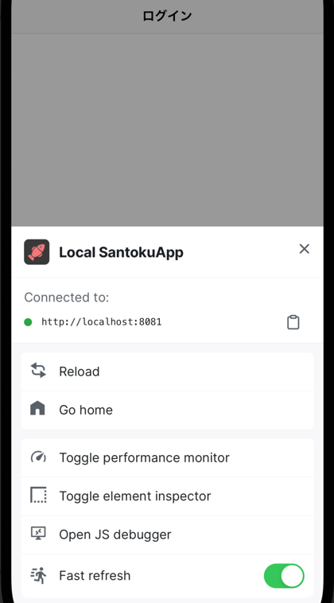

:::info参考
以下の記事を参考にして、このアプリのExpo SDKを51にアップグレードしました。
主な変更点とこのアプリで実施したアップグレード手順を紹介します。

- [Expo SDK 51 - Expo Changelog](https://expo.dev/changelog/2024/05-07-sdk-51)
- [React Native 0.74 - Yoga 3.0, Bridgeless New Architecture, and more · React Native](https://reactnative.dev/blog/2024/04/22/release-0.74)

なお、使用される可能性の低いEASとReact Native Webに関する内容は記載しません。
:::

## Expo SDK 51の主な変更

### React Native `v0.74.5`

詳細は、以下のリンク先を参照してください。

- [React Native 0.74 - Yoga 3.0, Bridgeless New Architecture, and more · React Native](https://reactnative.dev/blog/2024/04/22/release-0.74)
- [React Native CHANGELOG](https://github.com/facebook/react-native/blob/main/CHANGELOG.md#v0745)

Reactのバージョンは変更されておらず、依然として`v18.2.0`です。

#### Yoga 3.0

React NativeのレイアウトエンジンであるYogaのバージョンが3.0になりました。レイアウトの正確性が向上し、以下のような機能が利用可能になりました。

- `align-content: 'space-evenly'`
- `position: 'static'`

詳細は以下の記事を参照してください。

- [Announcing Yoga 3.0](https://www.yogalayout.dev/blog/announcing-yoga-3.0)

:::warning注意点
`flexDirection: 'row-reverse'`が設定されているコンテナで、`margin`/`padding`/`border`の振る舞いが変更されています。`left`/`right`/`start`/`end`の扱いがWebと異なっていたのですが、同じように振る舞うよう修正されています。

```typescript jsx title="影響を受けるコード例"
import {View} from "react-native";
<View
  style={{
    flexDirection: 'row',
    backgroundColor: 'red',
    margin: 10,
    width: 200,
    height: 100,
  }}>
  <View
    style={{
      flexDirection: 'row-reverse', // row-reverseを設定
      backgroundColor: 'blue',
      flex: 1,
      marginLeft: 50, // Yoga 2.0だと右側にマージンが取られていたが、Yoga 3.0では左側にマージンが取られるように修正された
    }}>
    <View
      style={{
        backgroundColor: 'green',
        height: '50%',
        flex: 1,
        marginLeft: 50,
      }}
    />
  </View>
</View>
```

| Yoga 2.0                                                                               | Yoga 3.0                                                                               |
|----------------------------------------------------------------------------------------|----------------------------------------------------------------------------------------|
|  |  |

`row-reverse`が設定されているときに`left`/`right`/`start`/`end`も反転して扱われていましたが、Webと同じ振る舞いになるように修正されています。
:::

#### `PropTypes`の廃止

React Native 0.73まではReact 15.5で廃止予定とされていた`PropTypes`が含まれていましたが、0.74ですべて削除されました。

- [RN: Remove Deprecated Prop Types](https://github.com/facebook/react-native/pull/42019)

もし`PropTypes`を利用している場合は、TypeScriptの型システムに移行することが強く推奨されています。

#### `PushNotificationIOS`の廃止予定

React Native 0.74では[`PushNotificationIOS`](https://reactnative.dev/docs/pushnotificationios)が廃止予定となっています。

この機能は0.75で削除されており、次のアップグレードまでにコミュニティの[@react-native-community/push-notification-ios](https://github.com/react-native-push-notification/ios)に移行する必要があります。

### Apple Privacy Manifest対応の追加

2024年5月1日から、App Storeにアプリを提出する際に[プライバシーマニフェスト](https://developer.apple.com/documentation/bundleresources/privacy_manifest_files)が必要となっています。

- [App Storeへの提出におけるプライバシー要件のアップデート](https://developer.apple.com/jp/news/?id=3d8a9yyh)
- [リマインダー：アプリ提出時のプライバシー要件が5月1日から適用されます](https://developer.apple.com/jp/news/?id=pvszzano)

Appleの定義する[理由の宣言が求められるAPI](https://developer.apple.com/documentation/bundleresources/privacy_manifest_files/describing_use_of_required_reason_api)をアプリのコードやSDKで利用している場合、それらの利用が承認される理由をプライバシーマニフェストファイルに記載する必要があります。

また、[Appleの指定するサードパーティSDK](https://developer.apple.com/jp/support/third-party-SDK-requirements/)を利用している場合もプライバシーマニフェストを含める必要があります。なお、これらのサードパーティSDKに関しては、SDKにプライバシーマニフェストが含まれるバージョンへの更新でも対応可能です。

プライバシーマニフェストが必要とされるにも関わらずApp Store Connectへアップロードしたアプリに含まれていない場合には、App Store Connect上で警告が表示されます。

ExpoのConfig Pluginを利用している場合、プライバシーマニフェストファイルに記載する内容を`app.config.js`で設定できるようになりました。設定方法の詳細については、[Privacy manifests - Expo Documentation](https://docs.expo.dev/guides/apple-privacy/)を参照してください。

### APNsのエンタイトルメントが自動的には追加されないように変更

`expo-notifications`を利用していない場合は、APNsのエンタイトルメントは自動では追加されないように変更になりました。

`expo-notifications`を利用していない場合にiOSで通知機能を利用する場合は、以下のように`app.config.js`に設定を追加する必要があります。

```typescript title="app.config.js"
module.exports = {
  expo: {
    ios: {
      entitlements: {
        'aps-environment': 'development',
      },
    }
  }
}
```

### Expo Goのサポート対象が最新版のみに変更

Expo Goはこれまで複数バージョンのExpo SDKで実装されたアプリを動かすことができていました。例えば、SDK 50時点のExpo Goでは、SDK 49で実装されたアプリを動かすことができました。

SDK 51からは、このサポート対象が最新版のみに変更されました。そのため、Expo SDK 51がリリースされたあとのExpo GoではSDK 51のアプリのみ動作し、SDK 50のアプリは動作しなくなっています。

[Expo Go - Expo](https://expo.dev/go)から対応するバージョンのExpo Goをダウンロードして利用することで、iOS実機以外では古いSDKのアプリをExpo Goで動かすことができます。しかし、iOSの実機では古いバージョンのExpo Goを動かすことはできません。

そのため実際のアプリ開発では、Expo Goではなく[development build](https://docs.expo.dev/develop/development-builds/introduction/)の利用が推奨されています。

### CameraとSQLiteの新APIがデフォルトで利用されるように変更

Expo 50で追加された`expo-camera/next`と`expo-sqlite/next`がデフォルトになり、[`expo-camera`](https://docs.expo.dev/versions/v51.0.0/sdk/camera/)および[`expo-sqlite`](https://docs.expo.dev/versions/v51.0.0/sdk/sqlite/)として公開されるよう変更されました。

Expo 50まではデフォルトで公開されていた旧APIは[`expo-camera/legacy`](https://docs.expo.dev/versions/v51.0.0/sdk/camera-legacy/)と[`expo-sqlite/legacy`](https://docs.expo.dev/versions/v51.0.0/sdk/sqlite-legacy/)に変更されました。

旧APIはSDK 51の間は利用できますが、SDK 52では削除される予定となっています。リリースノートでは、SDK 51へのアップグレード時は旧APIを使うように修正し、アップグレードが完了してから新APIに移行する手順が推奨されています。

### `expo-symbol`の追加

Appleの[SF Symbols](https://developer.apple.com/jp/sf-symbols/)を利用できるように、`expo-symbols`というライブラリが追加されました。AndroidやWebなどSF Symbolsを利用できない環境では、`fallback`として指定したコンポーネントが表示されます。

詳細については、[Symbols - Expo Documentation](https://docs.expo.dev/versions/v51.0.0/sdk/symbols/)を参照してください。

### Expoがサポートするライブラリや機能

以下に挙げる変更点の詳細やその他の変更については、[ExpoのChangelog](https://github.com/expo/expo/blob/main/CHANGELOG.md#5100--2024-05-07)を参照してください。

#### ライブラリの更新

- [expo-router](https://docs.expo.dev/router/introduction/) `v3.5`
  - 参考：[Expo Router CHANGELOG](https://github.com/expo/expo/blob/main/packages/expo-router/CHANGELOG.md#350--2024-04-18)
- [expo-asset](https://docs.expo.dev/versions/latest/sdk/asset/)
  - `app.config.js`に設定するだけで、ネイティブリソースを追加できるようになりました
  - 参考：[Load an asset at build time with expo-asset config plugin](https://docs.expo.dev/develop/user-interface/assets/#load-an-asset-at-build-time-with-expo-asset-config-plugin)
- [expo-local-authentication](https://docs.expo.dev/versions/latest/sdk/local-authentication/)
  - Androidでのローカル認証時に、[Class 3 biometrics](https://source.android.com/docs/security/features/biometric?hl=ja)のみを利用可能とするかどうかを設定できるようになりました
- [expo-secure-store](https://docs.expo.dev/versions/latest/sdk/securestore/)
  - [`SecureStore.canUseBiometricAuthentication()`](https://docs.expo.dev/versions/latest/sdk/securestore/#securestorecanusebiometricauthentication)が追加されました
  - この関数が`true`を返す場合は、セキュアストアの値を取得するときに認証を必須にできます（[`requireAuthentication`オプション](https://docs.expo.dev/versions/latest/sdk/securestore/#securestoreoptions)）

#### ライブラリの新機能

- [eslint-config-expo](https://github.com/expo/expo/tree/main/packages/eslint-config-expo)
  - Expoで開発するときのベースとなるESLint設定が追加されました
  - Expoプロジェクトで`npx expo lint`を実行すると、ESLintの設定ファイルが存在しなければ`eslint-config-expo`を使う設定ファイルが作成されます
  - 詳細は[Use ESLint and Prettier - Expo Documentation](https://docs.expo.dev/guides/using-eslint/)を参照してください

## このアプリで実施したアップグレードの手順

このアプリでは、[Expo 51へのアップグレード方法](https://expo.dev/changelog/2024/05-07-sdk-51#%EF%B8%8F-upgrading-your-app)を参考に、以下の作業を実施してExpo SDK 51にアップグレードしました。

アップグレードを実施したプルリクエストは[Pull Request #1322 · ws-4020/mobile-app-crib-notes](https://github.com/ws-4020/mobile-app-crib-notes/pull/1322)です。

1. [ExpoとExpoが管理するライブラリのアップグレード](#expoとexpoが管理するライブラリのアップグレード)
1. [`npx expo-doctor`でバージョン整合性を確認](#npx-expo-doctorでバージョン整合性を確認)
1. [既存パッチファイルの更新](#既存パッチファイルの更新)
1. [ビルドなどに利用するツールのバージョンを更新](#ビルドなどに利用するツールのバージョンを更新)
1. [APNsのエンタイトルメントを追加](#apnsのエンタイトルメントを追加)
1. [`defaultProps`の利用箇所を修正](#defaultpropsの利用箇所を修正)
1. [静的解析エラーの修正](#静的解析エラーの修正)
1. [自動テストの失敗を修正](#自動テストの失敗を修正)
1. [Expoの更新履歴確認と対応](#expoの更新履歴確認と対応)
1. [React Nativeの更新履歴確認と対応](#react-nativeの更新履歴確認と対応)
1. [`expo-template-blank-typescript`の更新履歴確認と対応](#expo-template-blank-typescriptの更新履歴確認と対応)
1. [`expo-template-bare-minimum`の更新履歴確認と対応](#expo-template-bare-minimumの更新履歴確認と対応)
1. [ライセンス情報を更新](#ライセンス情報を更新)

### ExpoとExpoが管理するライブラリのアップグレード

`npx expo install expo@^51.0.0 --fix`を実行して、Expo SDK 51の`expo`パッケージをインストールします。また、あわせてExpoが管理するライブラリもアップグレードします。

アップグレードの実行後に以下のログが出力されたため、`app.config.js`を修正しました。

```console
Cannot automatically write to dynamic config at: app.config.js
Please add the following to your Expo config

{
  "plugins": [
    "expo-secure-store"
  ]
}
```

```diff title="app.config.js"
       [
         'expo-build-properties',
         // 〜〜〜中略〜〜〜
       ],
+      ['expo-secure-store'],
       ['@react-native-firebase/app'],
       ['@react-native-firebase/crashlytics'],
       // このアプリで用意しているAndroid/iOS共通のプラグイン
```

### `npx expo-doctor`でバージョン整合性を確認

`npx expo-doctor`で確認したところ、いくつかのライブラリのバージョンについて警告が出力されました。

```console
Expected package @expo/config-plugins@~8.0.0
Found invalid:
  @expo/config-plugins@7.9.2
  (for more info, run: npm why @expo/config-plugins)
Advice: Upgrade dependencies that are using the invalid package versions.

The following scripts in package.json conflict with the contents of node_modules/.bin: orval.

The following packages should be updated for best compatibility with the installed expo version:
  @expo/config-plugins@7.9.2 - expected version: ~8.0.0
  babel-preset-expo@10.0.2 - expected version: ~11.0.0
  jest-expo@50.0.4 - expected version: ~51.0.4
  typescript@5.1.6 - expected version: ~5.3.3
Your project may not work correctly until you install the expected versions of the packages.
Found outdated dependencies
Advice: Use 'npx expo install --check' to review and upgrade your dependencies.
```

アドバイス通り、`npx expo install --check`を実行してバージョンの不整合を解消しました。

### 既存パッチファイルの更新

このアプリでは、[patch-package](https://github.com/ds300/patch-package)を使用して、以下のライブラリにパッチファイルを適用していました。
パッチ内容の詳細は、[こちら](https://github.com/{@inject:organization}/mobile-app-crib-notes/blob/v2024.10/example-app/SantokuApp/patches/README.md)を参照してください。

- `@expo/config-plugins`
- `expo-splash-screen`
- `react-native-elements`

`expo-splash-screen`は、Expo SDKのアップグレードに伴いバージョンが上がりました。しかし、適用していたパッチファイルはまだ必要な対応だったため、パッチファイルは削除せずに各ライブラリのバージョンに合わせてファイル名をリネームしました。

`@expo/config-plugins`はまだ必要な対応だったのですが、バージョンの更新に起因してパッチが失敗するようになりました。修正内容には変更はなかったため、利用しているバージョンでのパッチが成功するようにパッチファイルを作成し直して対応しました。

`react-native-elements`に関しては、バージョンが変わらなかったため変更はありません。

### ビルドなどに利用するツールのバージョンを更新

Node.jsのActive LTSはすでに20系になっているため、このアプリでもNode.js 20系を利用するように修正しました。

### APNsのエンタイトルメントを追加

APNsのエンタイトルメントは自動的に追加されなくなったので、`app.config.js`で設定するように修正しました。

```diff title="app.config.js"
         UIBackgroundModes: ['fetch', 'remote-notification'],
       },
       associatedDomains: [`applinks:${DEEP_LINK_DOMAIN}`],
+      entitlements: {
+        'aps-environment': 'development',
+      },
     },
     disabledPlugins: [
       // default plugin を無効化するために patch-package を使用して機能拡張している
```

### `defaultProps`の利用箇所を修正

アップデート後にアプリを起動すると、以下のようなエラーが表示されるようになりました。

```console
 ERROR  Warning: Overlay: Support for defaultProps will be removed from function components in a future major release. Use JavaScript default parameters instead.
    in Overlay (created by LoadingOverlayComponent)
    in LoadingOverlayComponent (created by Component)
```

`defaultProps`を利用している箇所については、以下のようにすべてデフォルト引数に変更して対応しました。

```diff title="Overlay.tsx"
 export const Overlay: React.FC<React.PropsWithChildren<OverlayProps>> = ({
   visible,
   onHideEnd,
-  fadeDuration,
+  fadeDuration = 200,
   style,
   ...props
 }) => {
@@ -89,10 +89,6 @@
   );
 };

-Overlay.defaultProps = {
-  fadeDuration: 200,
-};
-
 const styles = StyleSheet.create({
   overlay: {
     flex: 1,
```

### iOSでFullWindowOverlayを使用しているコンポーネントが表示されない問題の対応

アプリ起動後、スナックバーなど`FullWindowOverlay`を使用しているコンポーネントが表示されなくなっていました。  
この事象は、アプリ起動後に以下のようなExpo DevClientのメニューが表示された場合のみ発生するようです。



Expo DevClientのメニューに表示されている`Reload`をタップして、アプリを再読み込みするとスナックバーなどは表示されるようになります。  
そのため、このアプリではこの運用で回避することにしました。

### 静的解析エラーの修正

ソースコードフォーマットが微妙に変更されていたため、いくつかエラーが発生するようになっていました。

すべて自動修正可能なエラーだったので、`npm run fix`で修正して対応しました。

### 自動テストの失敗を修正

#### expo-constantsのモックからdefault以外もexportするように修正

Expo内部で`expo-constants`の`AppOwnership`などを利用するようになっていたのですが、モックがそれらを公開していなかったため以下のようなエラーが発生しました。

```console
TypeError: Cannot read properties of undefined (reading 'Expo')
```

モックファイルからデフォルトエクスポート以外もエクスポートするように修正して対応しました。

```diff title="jest/__mocks__/expo-constants.ts"
 import {wrapProperty} from '../utils/wrapProperty';

+export * from 'expo-constants';
+
 export const Constants = wrapProperty(ExpoConstants, {
   expoConfig: {
     name: 'SantokuApp',
```

#### Reanimated.ViewのanimatedPropsに渡す値を修正

React Native Reanimatedの`View`にはShared Valueを渡す必要があるため、[`useAnimatedProps`を利用するようガイド](https://docs.swmansion.com/react-native-reanimated/docs/fundamentals/animating-styles-and-props#animating-props)されています。

しかし、一部のテストコードで`useAnimatedProps`から取得した値を渡していない箇所があり、以下のようなエラーが発生するようになっていました。

```console
TypeError: Cannot read properties of undefined (reading 'remove')
```

`useAnimatedProps`で取得したものを渡すようにテストコードを修正して対応しました。

```diff
 describe('PickerContainer with all props', () => {
   it('should be applied properly', async () => {
     const afterSlideIn = jest.fn();
+    const {result: animatedProps} = renderHook(() =>
+      useAnimatedProps(() => {
+        return {
+          pointerEvents: 'none',
+        } as const;
+      }, []),
+    );
     /**
      * WithTimingConfigのeasingを取得できなかったため、以下のPropsは検証できていません。
      * - slideIntConfig
      * - slideOutConfig
      */
     const sut = render(
       <PickerContainer
         isVisible
         testID="animatedView"
-        animatedProps={{pointerEvents: 'none'}}
+        animatedProps={animatedProps.current}
         style={{backgroundColor: 'green'}}
         slideInDuration={200}
         afterSlideIn={afterSlideIn}
```

### Expoの更新履歴確認と対応

Expoの[CHANGELOG](https://github.com/expo/expo/blob/sdk-51/CHANGELOG.md#5100--2024-05-07)を参照して、Expo SDKとExpoが管理するライブラリの更新内容を確認しました。

ここまでの対応以外に追加で必要なものはありませんでした。

### React Nativeの更新履歴確認と対応

React Nativeの[CHANGELOG](https://github.com/facebook/react-native/blob/main/CHANGELOG.md#v0745)を参照して、React Nativeの更新内容を確認しました。

ここまでの対応以外に追加で必要なものはありませんでした。

### `expo-template-blank-typescript`の更新履歴確認と対応

[`expo-template-blank-typescript`の更新履歴](https://github.com/expo/expo/commits/sdk-51/templates/expo-template-blank-typescript)を確認しました。

`npx expo install expo@^51.0.0 --fix`で更新される依存ライブラリのアップグレードが主な変更でした。そのため、このアプリで特別な対応は必要ありませんでした。

### `expo-template-bare-minimum`の更新履歴確認と対応

このアプリでは[Config Pluginsに対応](./config-plugins.mdx)しているので、`expo-template-bare-minimum`の更新に伴う個別の対応は基本的に必要ありません。
ただし、以下の場合は個別に対応する必要があるため、この観点に絞って[`expo-template-bare-minimum`の更新履歴](https://github.com/expo/expo/commits/sdk-51/templates/expo-template-bare-minimum)を確認しました。

- このアプリで作成しているConfig Pluginsによる変更と、`expo-template-bare-minimum`の更新に伴う変更が競合した場合
- [Prebuild](../../development/build-configuration.mdx#prebuild)時に生成・更新されないファイル
- `android/`, `ios/`以外のファイル（`.gitignore`など）

ここまでの対応以外に追加で必要なものはありませんでした。

### ライセンス情報を更新

このアプリでは、使用しているライブラリのライセンス一覧を出力するスクリプトを用意しています。詳細は、[こちら](https://github.com/{@inject:organization}/mobile-app-crib-notes/blob/v2024.10/example-app/SantokuApp/.script/README.md)を参照してください。

#### `managed-license.js`の更新

ライセンス情報が不足しており補完したい、あるいは、開発時のみ使用するため除外したいライブラリとバージョンを[managed-license.js](https://github.com/{@inject:organization}/mobile-app-crib-notes/blob/v2024.10/example-app/SantokuApp/.script/managed-license.js)で管理しています。

ライセンス情報が不足しているライブラリなどは、以下のコマンドを実行することで確認できます。

- `node .script/check-licenses.js`

実行した結果、いくつかのライブラリのライセンス情報を更新する必要があったので以下を実施しました。

- 使用ライブラリの名前更新
- 使用ライブラリのバージョン更新
- 使用ライブラリのライセンスファイルURL更新
- 新規ライブラリ情報の追加
- 使用しなくなったライブラリ情報の削除
