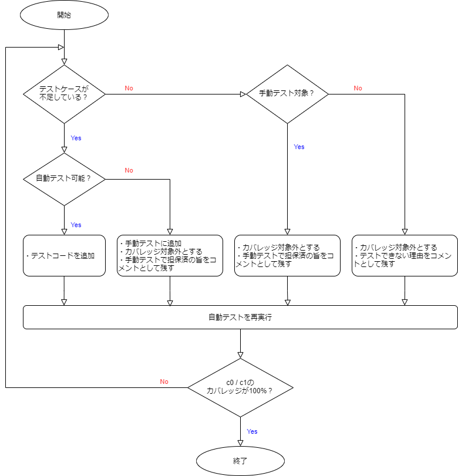

## テスト方針

単体テストでは、主に開発した画面や機能単位のレイアウト（表示崩れなど）と動作を検証します。これにより、画面や機能単位の品質を保証することが目的となります。詳細は全体テスト計画書の[テスト工程定義](/react-native/santoku/test-planning/test-all-planning.mdx#テスト工程定義)を参照してください。

## テスト実施範囲

- 対象

  - モバイルアプリで実装した機能や画面全般
  - ただし、モバイルアプリが利用するバックエンドや外部サービスとの連携部分はモックサーバ、もしくはJestのモック機能を使う

- 対象外

  - バックエンド

## テスト観点

全体テスト計画の[網羅の方針](/react-native/santoku/test-planning/test-all-planning.mdx#網羅の方針)に従い、単体テストのテスト観点は以下のとおりです。

- [レイアウト](/react-native/santoku/test-planning/test-type/functional-testing/layout-test.mdx)
- [操作やイベント](/react-native/santoku/test-planning/test-type/functional-testing/operation-event.mdx)
- [表示内容](/react-native/santoku/test-planning/test-type/functional-testing/display-content.mdx)
- [バリデーション](/react-native/santoku/test-planning/test-type/functional-testing/validation-check.mdx)
- [端末やOS](/react-native/santoku/test-planning/test-type/functional-testing/terminal-os.mdx)
- [ユースケース][]

基本的には、上記のテスト観点に従います。ただし、[ユースケース][]については、画面単位や機能単位で完結する範囲のユースケースに絞ります。

## テスト方法

事前準備、自動テスト、手動テストについて記載します。

### 事前準備

単体テストの実施に必要な事前準備項目は次のとおりです。

- 単体テスト仕様書

  テスト観点を元に、開発対象の画面や機能に応じてテストケースを網羅した単体テスト仕様書を作成します。また、テスト観点ごとのテスト方法に基づいて、各種テストケースの実施手段を自動テストと手動テストに分類しておきます。

### 自動テスト

#### 自動テストの利用ツール

- 自動テスト

  テスティングフレームワークには[Jest](https://jestjs.io/ja/) 、テスト用のライブラリには[React Native Testing Library](https://callstack.github.io/react-native-testing-library/)を利用します。

#### テストコードの作成

自動テストと分類されたテストケースに基づいて、テストコードを作成します。REST APIのような外部と連携する箇所は、Jestのモック機能で対処します。

#### 自動テストの実施

下記コマンドで自動テストを実施します。

  ```bash
  npm run test:report
  ```

このコマンドを実行すると、カバレッジレポートファイルが`coverage`フォルダに出力されます。もし、`c0/c1`のカバレッジが100%に達していない場合は、下記のフローに従ってください。



カバレッジ対象外とするには、次のとおり対応します。

- Jestがカバレッジを計算するために使用しているツール「Istanbul」の[カバレッジ除外記法](https://github.com/gotwarlost/istanbul/blob/master/ignoring-code-for-coverage.md#the-interface)に従ったコメントを記述
- カバレッジ除外のコメント記述箇所は、カバレッジ対象外としたいコードの直前
- カバレッジ対象外とする理由も併せてコメントとして残す

以下は具体例です。

```ts
// コンテキストの初期値として設定するメソッドはコールされるタイミングがないため、カバレッジ対象外とする
// （コンテキストのプロパイダをレンダリングする際、別の定義で上書きされる）
const Context = React.createContext<ContextType>({
  show: /* istanbul ignore next */() => {},
  hide: /* istanbul ignore next */() => {},
});
```

### 手動テスト

#### テスト実施環境

基本的にエミュレータ／シミュレータを用いて検証します。ただし、実機でしか確認できないようなOS依存の機能（例：カメラ）については、実機を用いて検証します。このアプリで、実機でしか確認できない機能は`iOSのカメラ`です。

- ビルドバリアント

  使用する[ビルドバリアント](/react-native/santoku/development/build-configuration/build-variants.mdx)は、`devSantokuAppDebug`です。単体テストでは性能面の評価をしないため、デバッグ効率を重視する方針です。

- テスト端末（実機）

  [テスト端末バリエーション](/react-native/santoku/test-planning/test-variation.mdx)から選定します。単体テストでは、AndroidとiOSのサポート対象内の最新OSを搭載した次の端末を使用します。

  - [Androidスマートフォン](/react-native/santoku/test-planning/test-variation.mdx#androidスマートフォン)の`機種B`
  - [iPhone](/react-native/santoku/test-planning/test-variation.mdx#iphone)の`機種E`

#### 手動テストの利用ツール

- モックサーバ

  モックサーバには[Mockoon](https://mockoon.com/)を利用します。

- エミュレータ／シミュレータ

  [エミュレータ／シミュレータの作成](/react-native/santoku/development/test/create-emulator-simulator.mdx)を参照し、エミュレータ／シミュレータを準備します。OSバージョン・アスペクト比率・解像度などの構成については、上記のテスト端末に合わせてください。

#### テストデータの準備

- モックデータ

  バックエンド連携用に、テストケースを網羅（異常系も考慮）したモックデータを準備します。

#### 手動テストの実施

次のとおり手動テストを実施します。

- 作成したテストケースに従い、機能や画面単位での動作を検証
- テストケースごとにAndroidスマートフォン（エミュレータもしくは実機）、iPhone（シミュレータもしくは実機）それぞれで検証
- 実際の動作とテストケースの期待結果が合致していることを確認

## テスト結果のエビデンス

テスト結果のエビデンスとして、以下のものを残します。

- 単体テスト仕様書

  テストケースおよび、テスト結果を記載したドキュメントです。

- カバレッジレポート

  自動テストで`coverage/lcov-report`フォルダ内に出力されるカバレッジレポートファイルです。画面単位や機能単位のエビデンスとして残す必要はなく、単体テストの最後にとりまとめます。

## テストの合否判断

下記項目をすべて満たしていることが、単体テストの合格条件です。

- [x] 単体テスト仕様書に記載したすべてのテストケースに合格していること
- [x] 自動テストを実行した際にエラーが発生していないこと
- [x] 自動テストの`c0/c1`のカバレッジが100%に達していること

[ユースケース]: /react-native/santoku/test-planning/test-type/functional-testing/use-case.mdx
