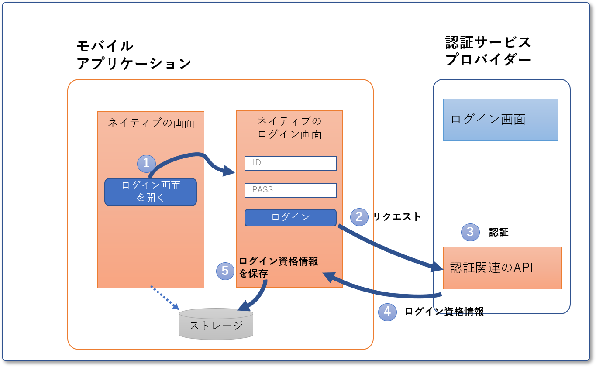
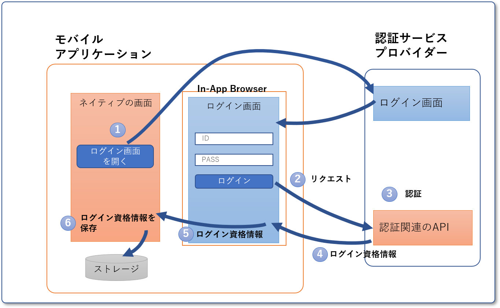
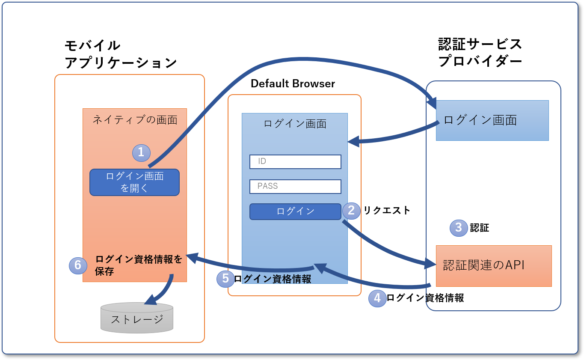

<!-- markdownlint-disable-file MD024 -->

モバイルアプリでは、ログイン画面をどのように表示するかについていくつか選択肢があり、それぞれで取りうる認証方法が変わってきます。

|No.|表示方法|取りうる認証方法の例|
|-|-|-|
|1|ネイティブ側に表示する|<ul><li>セッションID</li><li>OpenID Connect（[リソースオーナー・パスワード・クレデンシャルズフロー](./stateless-authn.md#リソースオーナー・パスワード・クレデンシャルズフロー)）</li></ul> |
|2|In-App Browserで認証サービスが用意しているログイン画面を表示する| <ul><li>OpenID Connect（[認可コードフロー + PKCE](./stateless-authn.md#認可コードフロー--pkce)）</li><li>OpenID Connect（ハイブリッドフロー）</li></ul>|
|3|Default Browserで認証サービスが用意しているログイン画面を表示する| <ul><li>OpenID Connect（[認可コードフロー + PKCE](./stateless-authn.md#認可コードフロー--pkce)）</li><li>OpenID Connect（ハイブリッドフロー）</li></ul>|
|~~4~~|~~WebViewに表示する~~|~~OIDC認証~~|

:::danger
OpenID Connectでログイン画面を表示する時にWebViewを使わないでください。代わりにIn-App Browserを使うように、2016/8にGoogle Developersから[勧告が出ています](https://developers.googleblog.com/2016/08/modernizing-oauth-interactions-in-native-apps.html)。
:::

なお、2～4に記載しているブラウザの種類と、各OSでのブラウザやSDKとの対応は次のようになります。

| ブラウザの種類    | Android            | iOS                    |
|-----------------|--------------------|------------------------|
| Default Browser | Chrome             | Safari                 |
| In-App Browser  | [Chrome Custom Tabs](https://developer.chrome.com/multidevice/android/customtabs) | [ASWebAuthenticationSession](https://developer.apple.com/documentation/authenticationservices/aswebauthenticationsession) |
| WebView         | [WebView](https://developer.android.com/reference/android/webkit/WebView) | [WKWebView](https://developer.apple.com/documentation/webkit/wkwebview) |

## パターンごとのメリット・デメリット

ログイン画面の表示方法ごとにメリット・デメリットを以下に示します。

:::info
以下に示す図は、モバイルアプリと認証サービスプロバイダー間の画面遷移を中心としてかなり簡略化した図です。仕様を正確に表現したものではないので注意してください。
:::

### 1. ログイン画面をネイティブ側に表示する

#### メリット

- アプリケーション内で認証が完結するのでUXが良い
- UIを自由にカスタマイズできる

#### デメリット

- モバイルアプリにユーザのIDとパスワードが渡ってしまうため、サードパーティの認証サービスは使えない
  - 例えば、SNSなどの認証サービスプロバイダーを使っている場合、モバイルアプリはユーザのSNSのIDとパスワードを知り、悪用できます
- Default BrowserとCookieを共有できないので、SNS認証などの場合一度Default Browserでログインしていても改めてログインが必要
- ログイン画面を自作する必要がある

### 2. In-App Browserで認証サービスが用意しているログイン画面を表示する

#### メリット

- アプリケーション内で認証が完結するのでUXが良い
- Default BrowserとCookieを共有できるので、SNSログインなどの場合、一度Default Browserでログインしておけば、改めてログインする必要がない
- セキュリティポリシーがブラウザベンダー準拠

#### デメリット

- In-App Browserを変更できる要素は、ツールバーの色や閉じるボタンのアイコンなどに限られているため、完全に思い通りのUIは実現できない

### 3. Default Browserで認証サービスが用意しているログイン画面を表示する

#### メリット

- ユーザが普段使い慣れたアプリケーションなので操作しやすい
- SNS認証などの場合、一度Default Browserでログインしておけば、改めてログインする必要がない
- セキュリティポリシーがブラウザベンダー準拠

#### デメリット

- 別アプリケーション（ChromeやSafari）なのでUIをカスタムできない
- 別アプリケーション（ChromeやSafari）を開いて認証後に戻ってくる必要があるので、UXが多少低下する
