## 認証とは

認証とは、何らかの手段によって対象の真正性を確認する行為です。
このガイドにおける認証対象は人間であり、本人認証を指します。
本人認証は、主に次のいずれかの要素で確認されます。

- 知っている（パスワードやPINなど、本人だけが知っている情報）
- 所有している（メールアドレスやトークンなど、本人だけが所持しているもの）
- 特徴がある（本人固有の身体情報）

### 認証方式の変遷

認証方式は、システム構成の変化やセキュリティ意識の向上と共に変化してきました。

2000年頃、Web技術の発展と普及に伴い、次に示す利点からWebアプリケーションが採用されました。

- クライアント側に特別なアプリケーションが不要（標準ブラウザのみで動作する）
- 更新が容易
- 広範囲へのサービス提供が可能

当時のWebアプリケーションは、ID/パスワードによる認証方式が主流でした。
認証機能は各アプリケーションに実装され、管理されていました。
一般的なWebアプリケーションのシステム構成図を次に示します。

業務の効率化やサービス拡大を背景に、様々なWebアプリケーションが構築されました。
その結果、ユーザの利便性やセキュリティ課題が生じました。

- アプリケーション毎にID/パスワードが異なるため、ユーザとサービス提供者双方の管理コストが大きい
- アプリケーション毎にログイン操作が必要なため、利便性に欠ける
- ID/パスワードの一要素のみで認証している場合が多く、認証強度が低い

そこで、各アプリケーションに認証機能を用意するのではなく、認証サービス（アイデンティティ・プロバイダ）を利用したシステム構成が採用され始めました。
また、モバイル端末の普及や（操作性向上を目的とした）SPA技術の台頭もシステム構成に大きな変化を与えました。
ユーザインタフェース部分はクライアントサイドで提供し、バックエンドはサービスのみを提供するシステム構成が昨今の主流となりつつあります。

:::note
本ガイドでは、上記システム構成のアプリケーションを（Webアプリケーションと対比して）サービスアプリケーションと呼称します。
:::

### 認証サービスを利用したシステム構成に関する不明点や課題

 認証サービスを利用したシステム構成に関して、次の不明点や課題があります。[^1]

- ユーザインタフェース部分がクライアントサイドに分離したが、ログイン処理の起点もクライアントサイドになるのか。この場合、認証サービスとの連携はどう実現するのがベストか。例えば、WebアプリケーションでOpenID Connect認証を用いる場合、（Webブラウザのリダイレクト機能を駆使した）認可コードフローが推奨されている。サービスアプリケーションの場合はどうするのか
- バックエンドサービスがAPIを提供するために、従来のセッションベースからトークンベースに変更しないといけないのか
- トークンはアクセストークン、IDトークンのどちらを使えばいいのか
- トークンの有効期限はどれくらいが望ましいのか
- 既存システムでは独自のアクセス制御を実装している。アクセストークンは許可の役割を持っているが、それを使うよう改修したほうがいいのか
- クライアントサイドのみ再構築したいが、認証基盤を変更する場合は改修コストが大きい
- （モバイルアプリケーションらしく）起動毎のログイン操作（ID/パスワードの入力を指す）なしに認証したい。どう実現すればいいか
- 毎回のログイン操作を不要とした場合、モバイル端末紛失や盗難時のリスクにどう対処すればいいか

[^1]: 不明点や課題に対する1つの解決手法として、[OpenID Connectと端末認証を用いたモバイルアプリケーションとバックエンドサービスの認証方式](./authn-with-backend-using-OIDC-and-device-authn.md)を紹介しています。

## 本ガイドで取り扱う内容

本ガイドでは、これらの不明点や課題解決を目的として、モバイルアプリケーションにおける認証技術やアーキテクチャについて解説します。
